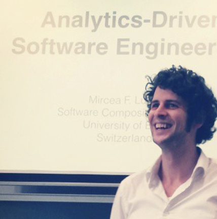

# Bio

 

Mircea Lungu is associate professor in computer science at the [IT University of Copenhagen](https://en.itu.dk/research). Before coming to Denmark he was assistant professor at the [Faculty of Science and Engineering](http://www.rug.nl/research/fmns/?lang=en) of [University of Groningen](http://www.rug.nl/) where he was a member of the [SEARCH](http://www.cs.rug.nl/search/) research group and the [Data Science Pioneers](http://www.rug.nl/research/fmns/themes/dssc/) group. He was also part time visiting researcher in the [SWAT](https://www.cwi.nl/research-groups/software-analysis-and-transformation) group at [CWI in Amsterdam](https://www.cwi.nl/). Before that he was postdoc at the [University of Bern](http://scg.unibe.ch/) in Switzerland, and for six months, visiting researcher at [IBM TJ Watson Research Center](http://www.watson.ibm.com/index.shtml) in New York. He got his PhD working with [Michele Lanza](http://www.inf.usi.ch/lanza/) and the REVEAL research group at the [University of Lugano](http://www.inf.usi.ch/), in Switzerland. His interests are in software visualization, tools for software evolution, human computer interaction, and personalized learning environments.

# Notes
[ChatGPT-and-CoPilot](notes/ChatGPT-and-CoPilot.md) | [Who-Is-Afraid-of-AGI](notes/Who-Is-Afraid-of-AGI.md) | [Importance-of-Maintenance](notes/Importance-of-Maintenance.md) | [How-to-Read-a-Research-Paper](notes/How-to-Read-a-Research-Paper.md) | [Good-Code-Is-Readable](notes/Good-Code-Is-Readable.md)  | [The-Obsession-with-Science](notes/The-Obsession-with-Science.md) | [A-Performance-Problem](notes/A-Performance-Problem.md) | [Book-Reviews](notes/Book-Reviews.md) 

# Research Interests
- [Software Visualization](directions/visualization.md)
- [Empirical Studies in Software Engineering](directions/empirical-studies.md) 
- [Tools for Supporting Software Evolution](directions/tools-for-evolution)
- [Personalized Learning Environments](directions/personalized-learning-environments) 
- [Fighting Social Media Addiction](projects/aiki.md) 

# Research Prototypes 
I always loved and I still love coding. However, nowadays I'm more of a product owner that guides and advises talented groups of students that create and evaluate innovative prototypes. Some of these projects are: 
- [Git-Truck](projects/git-truck.md) - visualizing git repositories for fun and profit
- [Flask Monitoring Dashboard](projects/flask-monitoring-dashboard.md) - a lightweight API monitor for Flask/Python systems 
- [Zeeguu](projects/zeeguu.md) - personalized adaptive reading and vocabulary practice online
- [MathsCamp](projects/maths-camp.md) - personalized maths for kids
- [Aiki](projects/aiki.md) - a browser extension that uses procrastination for good

[> past projects](/projects/history.md)

# Student Projects
If you're interested in a student project, please look at the [list of projects available on GitHub](https://github.com/mircealungu/student-projects/). Alternatively, look at the prototypes and directions listed above. At the end of each, there are several ideas of possible future directions. Also, when contacting me for a project please **send me 1) a recent CV, 2) a transcript of your grades, and 3) a link to your GitHub repository**. This helps me understand what are your strengths and weaknesses and advise you towards more appropriate projects.

# Teaching

I am currently teaching or co-teaching the following courses at ITU:

- [DevOps and Software Evolution](https://github.com/itu-devops/lecture_notes), with H. Pfeiffer, Spring (2020 - ...) 
- Technical Interaction Design, Fall (2019 - ...)
- Software Architecture, with K. Manikas, Fall 2018, Spring (2019 - ...)
- Advanced Software Engineering, with Y. Dittrich, E.Paja, P. Tell, H. Pfeiffer, Fall (2019 - ...)

In the past I have been involved in teaching a wide variety of computer science courses, including: Concurrent Programming, UI Design, Compiler Construction, [Introduction to Data Science](http://www.rug.nl/ocasys/fwn/vak/show?code=WMCS16002), [Software Engineering](http://www.rug.nl/ocasys/gmw/vak/show?code=INBSE1-08).

# News
- Nov, 2022 - Visiting the lab of Gregorio Robles and Jesus Gonzales-Barahonja at U. Rey-Juan Carlos in Madrid
- Oct, 2022 - Attending Vissoft 2022 where we're presenting two papers about [Git-Truck](projects/git-truck.md). 
- Sept, 2022 - Accepted to become the General Chair for the Vissoft 2023 which will happen in Bogota, Colombia

[more news](news/history.md)

# Further Web Coordinates
- GitHub: [mircealungu](https://github.com/mircealungu) 
- Twitter: [@mircealungu](https://twitter.com/mircealungu) 
- Research: [Google Scholar](https://scholar.google.nl/citations?user=7zx6Cg0AAAAJ&hl=en) [Research Gate](https://www.researchgate.net/profile/Mircea-Lungu-2) 
- Other:  [IT University Page](https://pure.itu.dk/portal/en/persons/mircea-lungu) 

# Contact 
- Office: 4th Floor, DR Building, Emil-Holms Kanal, 2300 Copenhagen, Denmark
- Email: mlun -that-sign-  itu  -dot- dk 

[.](notes/Book-Reviews.md) [.](./essays/bitcoin-a-) 
