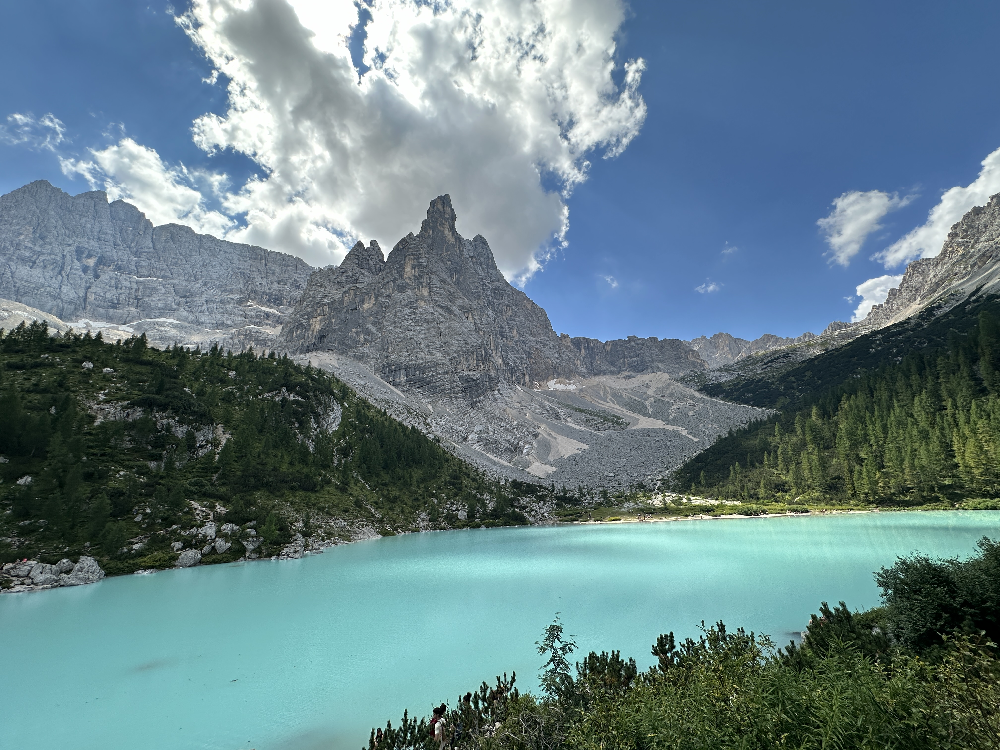

# Lago di Sorapis 

  

Start: Passo Tre Croci
Duration: 2h + 2h
Difficulty: medium
Super busy

11.05 - The lake seems to be famous... It's 11.05 and We have to park 2km below the Passo Tre Croci parking and hike along the street. It's busy. 

  

Trail is quite busy too. And pretty. 

  

  

11.50 - last water till peak

  

  

  

12.32 - the climbing gets steeper; still very busy; but on the left we see that we're quite high now.

  

12.40 - around the corner a beautiful glacier valley

  

  

1300 - Chains are needed for the ones who don't like heights; the fall to the left is super abrupt

  

  

  

It's so busy and so many people that are not used with the mountain that when you stop to give priority to the ones going up, people are really surprised. At some point I got twenty *grazie* in a row I think. That's quite a surge is serotonin I think. 

  

(Musing: Every time I think zeeguu is a bad name i remember hoka and airtox...)

  

13.40 - finally at the lake. Beautiful glacial colors. And many people to enjoy it. The photo does not do justice to the number of tourists. And so many French today! 

  

By 15.30 the riffuggio is still busy; but not absurdly busy anymore. 

  

  
16.30 - starting down

17.20 - on our way

1820 - We're back to parking.
