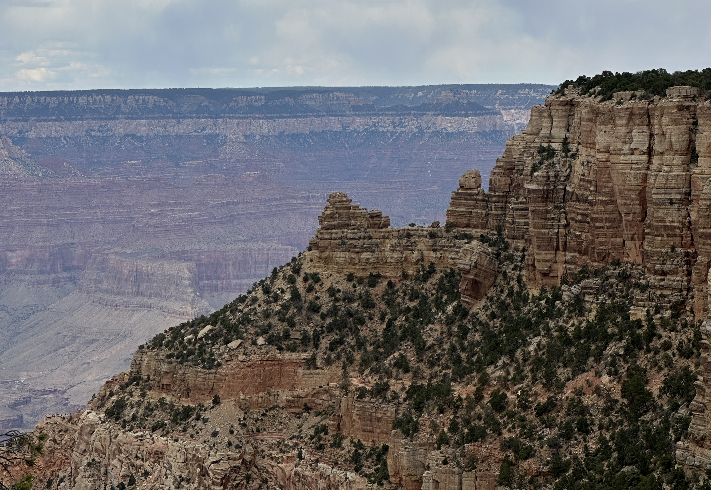
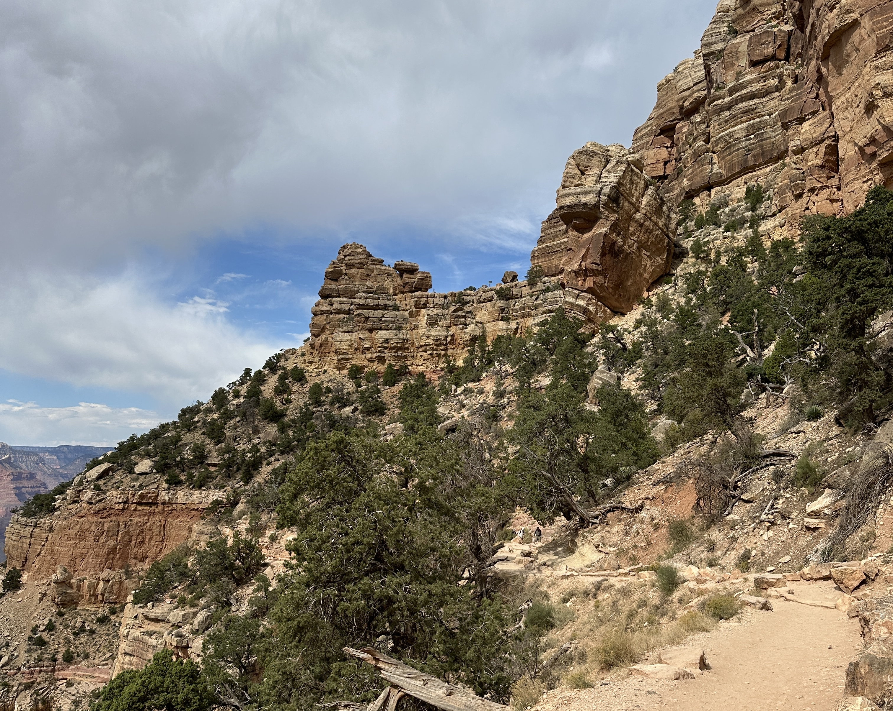

# Mini-Incursion Into the Grand Canyon

October 8, 2024

The day off, between VISSOFT and ICSME we took a trip down to the Grand Canyon. 

We were based in Flagstaff, so went to the South Rim. 

Because of car rental issues, we left Flagstaff around 9.30 and arrived at the entrance of the park around 11. Although it was a Tuesday, we found at huge traffic jam before the entrance, and spent more than one hour in the queue. We had read online that if you have an access ticket you can take the left lane and be faster. We stopped thus in a city before the entrance to buy tickets. It did not help. Nobody respects enforces the rule about the left lane as of 2024. 

Once past the entrance, very quickly the road opens onto the canyon. We saw it, we stopped and jumped off to admire and take photos. 

The view from the South Rim is indeed spectacular, and photos can not really do it justice. 

We realized that the trail we were planning to take was only 15min of walking away, so we continued on foot. 

Soon we were at the South Kaybab Trail and we start down. The trail starts abruptly and soon one starts to feel inside of the canyon. 

Trail is dusty. 

But view is spectacular. 

Gregorio, Leonel, and David, my VISSOFT co-organizers are leading the pack. Only Jesus is missing! 

We quickly arrive to the first named point on the trail is the famous Ooh-Aah point where Valentin looks happy. 

The red-dust trail continues spectacularly.

About one hour and a quarter after starting down we arrive at Cedar Ridge. We take a group photo with the brave and then we go back up because we have budgeted for going up twice as much as going down, and we did start late after all. 

The only slight disappointment is that, as we talk to two other hikers, we learn that if we continued maybe 1h more all the way to Skeleton Point, we could have seen the Colorado River. Next disappointment is when the next day I met one of the students of Andrea Capiluppi who went all the way down a day before. That must be really amazing. And for another time.  