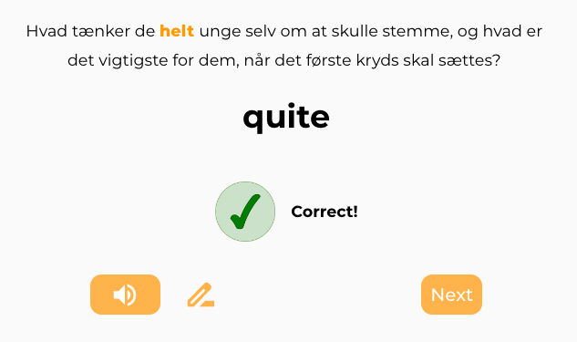

**Aug 14**

expression found in: https://www.zeeguu.org/read/article?id=2542795
- ud i lys lue = into the open (literal *out in the bright hat* ?)

**Jul 11**

While doing exercises, I find the following:

Even with the context, the meaning of `helt` still feels a bit elusive. I guess if I would see more examples? Or better examples? 

Looking in ordnet I see that there are also nouns for helt, but that in this case it's an [adverb](https://ordnet.dk/ddo/ordbog?select=helt,3&query=helt)which can have two meanings, one more abstract than the other. And it is part also of many `faste udtryk` -- fixed expressions. 

How is one to take this into account while studying? Should we?

Then I see this:

It makes me wonder: what are the declinations for this? Should I be able to dive into a new exercise to test my memory of the conjugations?

Looking at the [conjugations](https://www.verbix.com/webverbix/go.php?T1=skete&D1=26&H1=126) for *skete* I realize that there're examples with "Jeg sketer" ... I happen?!?! 

While navigating ordbog.dk I learn that `elsker` comes from Norse `elska` which means `close, cultivate`. That seems to align with some of the advice that `love` is something that you `cultivate`. 

[`Stemme`](https://ordnet.dk/ddo/ordbog?query=stemme) is also, both `voice` and `vote`. This is also a bit poetical!

Took me 9 *active minutes* to finish my 23 words that were due today. The total time was more like 50minutes - because I kept navigating to ordbog... 

**Jul 7**

- did the exercises quickly, started working on a new text
- this is hard: 
	- i wonder, will `ved siden` be prioritized? it seems like an important word
	- 

**Jul 6**

Quite a long time since I last studied. 
It's too easy to lose the "streak" and so hard to start.
There's no wonder that Duolingo puts so much emphasis on the streak. 

In any case, starting with exercises
- i'd love if after i solve a word, it's automatically pronounced; at least for Danish this makes sense for me; the pronunciation is so important
- when I do multiple choice, i'd like to have the counter update as soon as I get a correct pair; that would make also clear the fact that the last one does not count, because the counter will not change :)
- did i just see the counter jump from 13 to 11 after choosing *"don't show this word again"* and providing feedback for it? 

In a situation like the one in the picture, the "keep exercising" could be more informative: and say something like: "ideally there's 4 more words that would be ideally practiced today".

**Jun 21**

Starting with exercises today
- had one in which the context was repeated with a missing word; it was a bit easier but it felt nice

It took me three retries to get `svagheder` correctly:

was wondering: should we be more specific with the feedback? I.e., pay attention to the spelling? 

I'm thinking: would it have helped to send a reminder with the words for today via email? Such that people don't forget and too many words accumulate? Let's se that happen first :)

**Jun 20**

Started reading an [article about whether English borrowed words from Danish](https://www.zeeguu.org/read/article?id=2506904). It was quite long and I didn't finish it. 
Then did some exercises, but the words of yesterday didn't show up. There was only one word left, that I could solve because it was a triple-choice and I remembered the word I didn't get yesterday... So I solved it. 

I also had  to translate again in the text `isaer` = especially IIRC. I know I'm in the learning process with this word. 

Later I went to the exercises tab again and started getting new exercises. I guess based on today's reading. But it wasn't clear.

**Jun 18**

Read an [article](https://videnskab.dk/krop-sundhed/forskere-har-mistanke-om-at-autisme-og-adhd-kan-kobles-til-forstyrrelser-i-tarmbakterierne/) about a big study that seems to find a correlation between autism and ADHD. 

spent 14min in total. (zeeguu estimation: 5min)
translated quite a few words:

also, some of the triple word expressions seemed relevant. it's a pity that we don't have exercises for them at the moment? e.g. "*lidt for entusiastik*":

while practicing exercises, it is a bit funny that I have to click on the speaker icon. i'm looking at *svagheder* - why do I have to move the mouse elsewhere to pronounce it?

this one was just too hard: 

after doing something like 8 or 9 exercises I got tired and abandoned the session. there was no feedback in this situation. i guess i didn't deserve it? :) or should we intercept this kind of situation maybe?