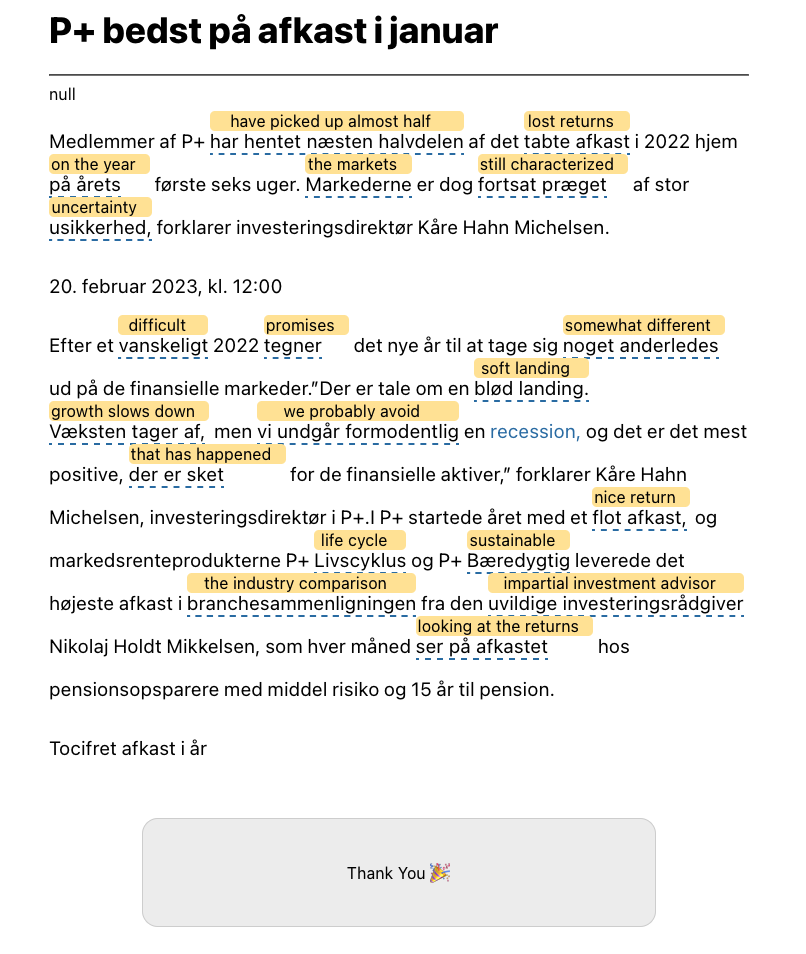

Zeeguu supports the learner with translations. 
However, even in such a situation, some articles are too difficult.

Take for example this article that was recommended to me by my pensionskasse. After reading it's still a bit unclear to me in parts, and overall I can say that it was "too hard". I've provided this feedback to the system. 

However, one question that I still have is: can we quantify what is too hard for readers? Let's look at some of the data in Zeeguu to learn this. 

