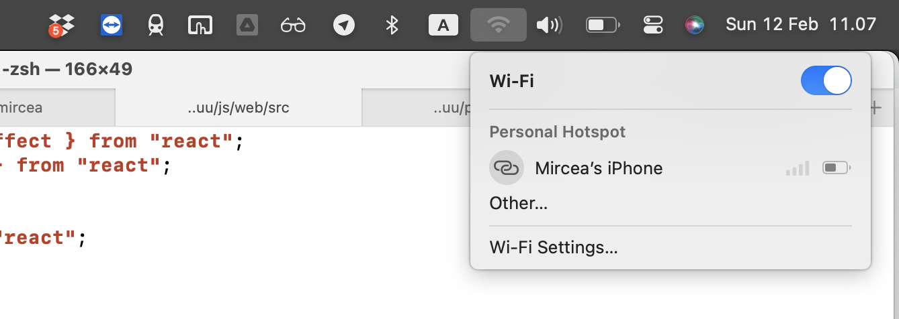

# The Badly Design of Everyday Things

Title is inspired by the seminal **TDoET** book. 

## The menu item that was a toggle for no good reason

There is no good reason for the toggle button in the WiFi menu in OS X Ventura. It's a menu item, that you can't click on the whole width, but rather you have to go hunt for the little button at the left. So, every time one wants to toggle the state, they have to a  stupid L-shaped mouse move. 

And for what? Because it represents an on/off state? What about all the other menu items in all the other apps in the OS that also represent on/off states? E.g. Show/Hide Sidebar/Favorites/Status/etc.

In my opinion, Apple UX folks are being pedantic and achieving nothing but decreasing the usability with a minute.

