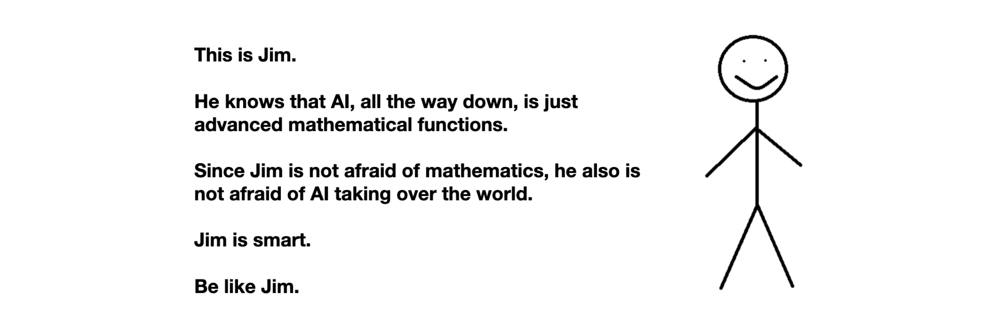

# Who Is Afraid of AGI?

*February, 2023*

AGI stands for Artificial General Intelligence. 

It is theoretized to be the level of AI at which an "algorithm" exposes general inteligence on par with a human. It is the "phylosopher's stone" of the modern techno-alchemist. Note that the field of AI is nowhere near to any such level, most of the algorithms are narrowly focused on a single domain. And it should be like that. Algorithms are tools, and tools are there to enhance our capabilities, not to replace us. 

Many people, and sometimes even smart ones, are afraid that we are on the verge of inventing an AGI that will be more "intelligent" (whatever that may mean) than humans. 

At that point, there is only one more step to the apocalypse. The AGI will start improving itself... And next thing you know, the techno-apocalypse is upon us because the, by now, super-AGI is so much more intelligent than humans that he is like a God that might just decide to dispose with our species. Or make us into its pets. The techno-apocalypse. Just one more apocalypse in a long series. Do you bet on it? I don't. 

Anyway, reportedly, Elon Musk can't sleep at night because of his worries about AI and AGI. 

My advice those who are afraid of AI turning into AGI  is to realize that AI is just advanced mathematics. It's a mathematical function. You give it some input. It provides some output.  Surely, there is a clear increase in complexity when one goes from linear regression, to logistic regression, to neural networks, to deep neural networks, and to large language models (e.g. ChatGPT), but in the end, each one of these models is, nothing more than a very complicated mathematical function representing a statistical approximation derived from very large quantities of example data. 

It is my belief that being afraid of AI, literally means you're afraid of mathematics. Yes, it's true: we're all a bit afraid of complicated mathematics, but that's because we're too lazy to put the time and understand it, not for any objective reason. And also, until recently, we hid this fear; it's only recent that we're writing long articles and books about our fear. So, we should take it easy, and definitely not lose sleep over this fear. 

I've made a visual summary of this idea: 

## Further Notes

- Unlikely to have AGI w/o a sense of self [eliot miranda on linkedin](https://www.linkedin.com/feed/update/urn:li:activity:7022617377229983744/) . And a sense of self does not easily come without a body is my conjecture. 
- Elon musk [can't sleep at night](https://www.geospatialworld.net/blogs/scares-elon-musk-artificial-intelligence/) because he's afraid of AI; Bostrom also wrote [about his fears in a book](https://www.vox.com/future-perfect/2018/11/2/18053418/elon-musk-artificial-intelligence-google-deepmind-openai) - at least he's capitalizing on his fears
- The whole discussion about LLMs and the fear thereof, reminds of of the Arthur C. Clarke saying "*Any sufficiently advanced technology is indistinguishable from magic*". A lot of the fearful don't understand how these models work. I think there's another cohort of the "fearful", probably a smaller number, the behavior of which can be explained by another dictum: "*You can not make somebody understand something, if their job depends on not understanding it*". These are the pundits, the journalists, the researchers who by hyping up the "potential" of the technology benefit themselves in one way or another. 
- There's also the fear of some of these algorithms taking over our jobs. It might take over some jobs and it will help us get better at other jobs. Washing dishes has been taken over by robots and nobody misses it. Chess has been automated to the point where no human can beat an algorithm, and that does not prevent us to still enjoy the game and admire Magnus Carlsen and the other amazingly talented human players. In fact, the chess engines are just helping everybody to become better at playing the game. This second is the future that I see of language models. 
- Sure, if we put statstical functions that we don't fully understand inside systems that can harm humans, than we should be afraid. But that's a stupid thing to do; and in that case the fear should not be of the AI component itself but of the unpredictibility of the whole resulting system. My rule of thumb is this: use AI if you can "undo" its action (spam classification, code completion) or if you don't give a speck about mistakes (image search that returns a muffin in between dogs) then use AI as much as you can. However, don't let an AI algorithm drive your car or shoot weapons. Driving over a child can't be undone . And you do care about mistsakes in weapon-related situations too. 