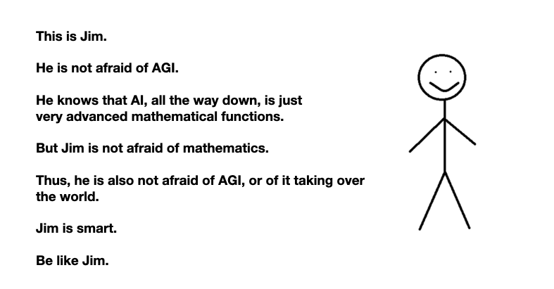

# Who Is Afraid of AGI?
*draft*

AGI stands for Artificial General Intelligence. 

It is theoretized to be the level of AI at which an "algorithm" is as intelligent as a human. It is the "phylosopher's stone" of the modern techno-alchemist.

Many people and sometimes smart ones are afraid that once we invent an advanced enough AI, there is only one small step to inventing an AGI - an AI that is as "intelligent" (whatever that may mean) than humans. At that point, there is only one more step to a more-intelligent-than-humans-algorith. This "algorithm" will then start improving itself. And soon after that, the techno-apocalypse comes because the super-AGI is now so much more intelligent than humans and it might just as well decide to dispose with our species. 

Reportedly, Elon Musk can't sleep at night because of his worries about AI. 

Some less excited people, like Gary Marcus and Grady Booch debate whether AGI will happen in our lifetime or maybe not even in the lifetime of our children's children. It does not matter, sooner or later there will be something that 

My claim is that those who are afraid of AGI as the next step in the progress of current AI techniques are *literally afraid of mathematics*. 

This is the visual summary of this note: 

And below is the text version, although it's quite superfluous, I think the image says it all, and better.

*Text version...*

The AI that makes the news today and that scares everybody because it seems  *sentient* or just impressive in what it can do (e.g. DALLe, coPilot) is dominantly Deep Learning -- the latest in a series of mathematical function approximations. Skipping over the details, I'll try to suggest how even the more complex models are just (incredibly complex) mathematical functions. 

So let's start with **linear regression**. It's a basic statistical technique for approximating a series of values with a linear function. Used  to be statistics. Now it's AI. You can find it in the famous course of Andrew NG at Stanford. And it's mathematics. It looks like below, and you might not like it, you might not understand it, but you should not be *afraid* of it. 

-----> TODO: insert picture explaining linear regression

The next step is **logistic regression**, a variation that does not approximate a linear funciton, but rather uses a strongly skewed but still linear function in order to classify outputs. 

-----> TODO: insert picture explaining logistic regression

Then we have **neural networks**. They are structures inspired from a trivialized and not too accurate model of how neurons work in the human brain. If the models until now were linear functions, the neural networks can approximate also non-linear functions. Thus, where logistic regression could model linear problems, these can model also non-linear ones. The challenge with the neural networks is that they start to need more training data than the regression models. But they also do cool stuff. However, you're not afraid of them taking over the world, and for good reason. 

------> TODO: insert picture explaining neural networks

Then we have **language models**. Training these neural networks with pairs, or triad of words. And based on that, the network captures probabilities of a given word following a set of previous other words. These systems are limited because they can't complete well sentences that where the next word depends on another one that was many words back. 

------> TODO: insert picture explaining n-gram architecture

And then on the path to AGI, *seemingly* come **large language models**. These are all the hype as of AD 2023. Examples are  ChatGPT and the Google chatbot that made one of the Google employees to go to the press to report that he discovered sentience after chatting with the bot. 

------> TODO: insert picture explaining large language models

These systems have many many many more perceptron-structures inside them, and an architecture that allows them to to look to many more words before for context. Some of them model with probabilities the impact of a word that is two paragraphs before on the next predicted word. And they can be thought of as non-linear functions with many parameters (millions parameters). They need very large amount of text in order to adjust the internal next-word probabilities inside of them. But after all, they are still a more advanced version of the function that predicts the next word based on a series of previous others. 

And even if their functional form is not easy to write, indeed these highly parameterized functions are scarily complicated to even draw, they are still mathematical functions. 

So being afraid that a mathematical function that predicts the next word based on the statistical probability will suddently become more intelligent than humans and eventually will take over the world and subjugate humanity is silly. It's just mathematical functions. Don't be afraid of them. Rather, try to understand them, and see in which way can you use them. 

So, next time you can't fall alseep because you're afraid of AI, remember that all that current AI is is advanced mathematics. And it is the not very smart kids who are afraid of mathematics. Don't be like them :) 

## References

- Unlikely to have AGI w/o a sense of self [eliot miranda on linkedin](https://www.linkedin.com/feed/update/urn:li:activity:7022617377229983744/) . And a sense of self does not easily come without a body. 
- Elon musk [can't sleep at night](https://www.geospatialworld.net/blogs/scares-elon-musk-artificial-intelligence/) because he's afraid of AI; Bostrom also wrote [about his fears in a book](https://www.vox.com/future-perfect/2018/11/2/18053418/elon-musk-artificial-intelligence-google-deepmind-openai) - (at least he's capitalizing on his fears)
- What Software Engineering teaches us about AGI - The customer does not know what they want; everybody thinks they know what they talk about at the high-level; when they are faced with details, they realize that it wasn't exactly it; in the context of AGI - nobody thinks much too deeply about the consequences of creating an actual human-like-AI; for a good example is the [short story about MMAcevedo](https://qntm.org/mmacevedo) - a fantastic little gem of SF where SF does what it does best; takes an idea and explores it's implications; in this case it's the idea of uploading one's mind in a computer; sounds nice, right? (see also the [discussion](https://www.reddit.com/r/slatestarcodex/comments/lqr8hu/fiction_mmacevedo_the_brain_image_of_the_first/) about the story on r/slatestarcodex)

## Half-baked related ideas
- we "fly" but not like birds; computers solve problems, but not like humans; 
- you can be afraid of AI, but in a different context: if people who are in "awe" of the technology connect it to dangerous systems. but then, the fear is not of the AI per se, but of the connecting of the dangerous system (car, application evaluation, etc.) to a statistical model that nobody understands exactly the workings of