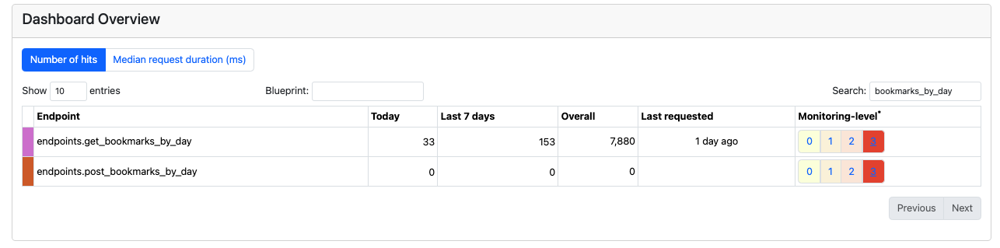

# Who Uses This Endpoint

Very often, when you have an API you wonder - is anybody using this endpoint. Well, once it's public, you can never be sure... but when you are the owner of both front-end and backend you can have more confidence. Even so, sometimes you're not sure, and a tool like FMD can remove the doubts. 

Today we were looking with Tiago at two endpoints, a GET and a POST, and we were not whether they were both called by the front-end or not. After a quick glimpse at the FMD it became clear: the second one has never been called, while the first has been called multiple times today, this week, and overall. 

In the general case, it might still not be sure ... what if we have some clients that use this very rarely. In our case, it became clear to use that the second is not used and can be removed. 

