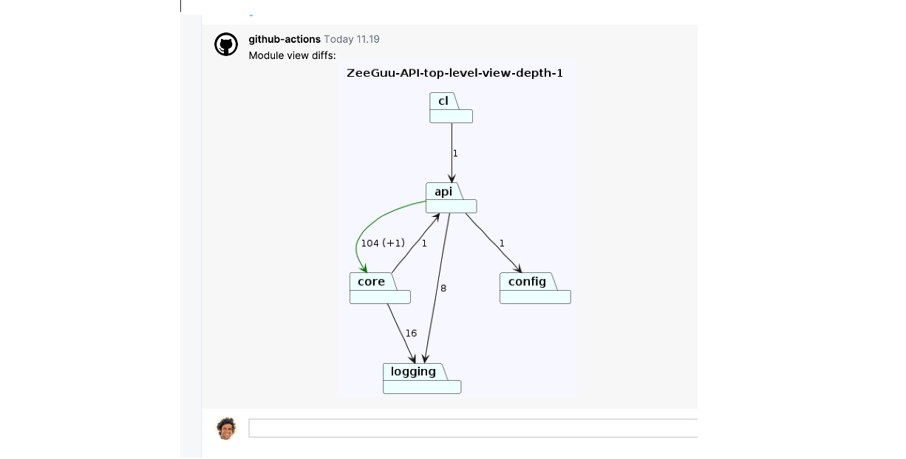

# ArchLens 

ArchLens ([GitHub](https://github.com/archlens/ArchLens)) is a project that aims to help developers **keep track of the evolution of the structure of their systems** by allowing them to quickly define module views and then visualizing their evolution. 

A [vision paper](https://www.overleaf.com/read/zbcctdmkbgpv#b4ce30) is written by Mircea about the project. 

# Contributors

Multiple students have contributed to the current version of Archlens in their master's thesis and research projects: 
- Nikolai Perlt Andersen
- Jesper Kronborg Rusbjerg
- Bjørnar Haugstad Jåtten
- Magnus Albeck Klitmose
- Mathias Baunsgaard Kristensen
- Simon Boye Jørgensen

# Possible Student Projects

Several possible future directions for ArchLens are: 
1. **Port ArchLens to C#** - when we were looking for participants for evaluating the earlier versions of ArchLens with companies in Copenhagen it was hard to find companies that have Python systems. It would be wonderful if a team of students would port the analysis module to C# such that more people would benefit from it
2. **Intelligent Selection Of Views Inserted as Comments in the PR**. Indeed, currently all the ArchLens views are always inserted in the PR even if no diff is visible inside of a given view. This is not smart because the developers will start ignoring the comments. Views should be highlighted in the pull request only if they highlight an actual change. See [the example below](#Nov%202024%20-%20Smarter%20Selection%20Of%20Views%20Inserted%20as%20Comments%20in%20the%20PR)
3. **Automatically Detecting Modules** to be shown in the views. What if the developer didn't even have to define what were the modules in the views, as they do now, but we somehow automatically detected it. 
4. **A More Expressive Language** for architectural view definitions...
5. **A JS layout engine** that is also running locally in the browser as opposed to delegating to the PlantUML server. After all, we're not using so much from UML... 

# Journalling the Use of ArchLens with Zeeguu API

## Nov 2024 - Smarter Selection Of Views Inserted as Comments in the PR

It would be good to be smarter on which views are introduced in the PR by the GH action. Currently views are introduced even if there is no visible element being added or removed in that view. 

## Jun 11, 2024

Looking at a PR from Tiago I see that he introduces a new dependency from API to core: 

Looking at this view, I have a strong curiosity: *"Why is there a new dependency between api and core?"*. It feels like maybe I should be able to see what is this +1 is! What is the simplest way to answer this question? And then... should it matter? After all, it's architecturally correct, there's a strong dependency between the two, there's just a new call, it's fine. The details are in the code diff. Or? 