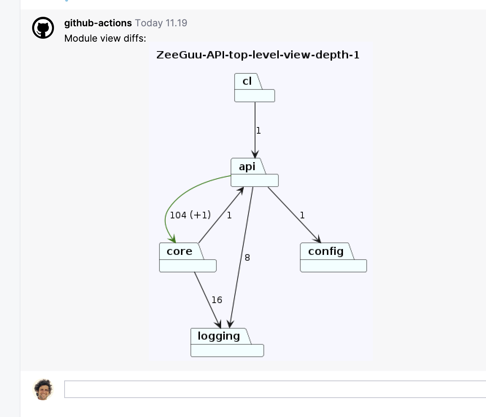

ArchLens ([GitHub](https://github.com/archlens/ArchLens)) is a project that aims to help developers keep track of the evolution of the structure of their systems by allowing them to quickly define module views and then visualizing their evolution. 

# Journalling the Use of ArchLens with Zeeguu API

*Jun 11, 2024*

Looking at a PR from Tiago I see that he introduces a new dependency from API to core: 

Looking at this view, I have a strong curiosity: *"Why is there a new dependency between api and core?"*. It feels like maybe I should be able to see what is this +1 is! What is the simplest way to answer this question? And then... should it matter? After all, it's architecturally correct, there's a strong dependency between the two, there's just a new call, it's fine. The details are in the code diff. Or? 