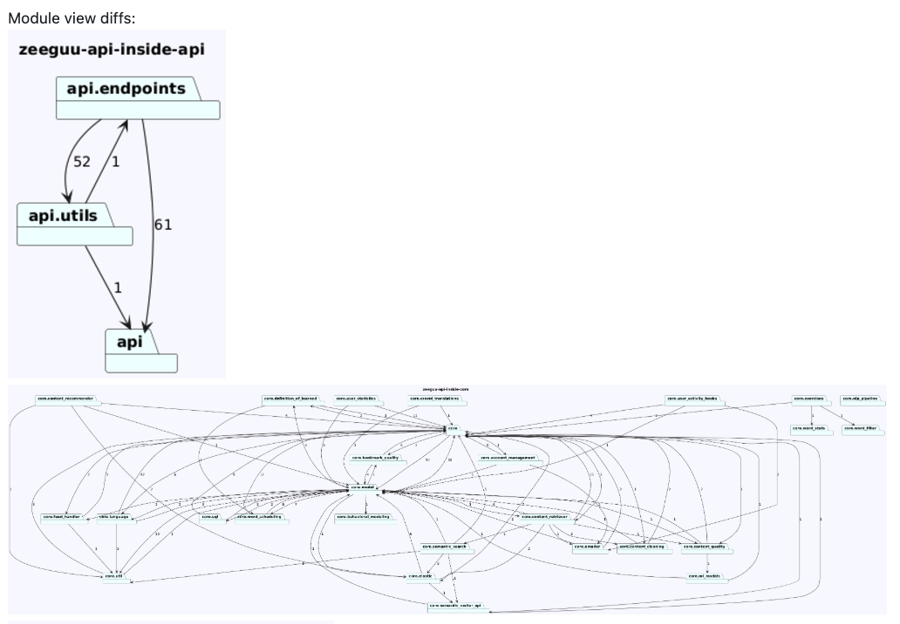

# ArchLens 

ArchLens ([GitHub](https://github.com/archlens/ArchLens)) is a project that aims to help developers keep track of the evolution of the structure of their systems by allowing them to quickly define module views and then visualizing their evolution. 

A [vision paper](https://www.overleaf.com/read/zbcctdmkbgpv#b4ce30) is written by Mircea about the project. 

# Contributors

Multiple students have contributed to the current version of Archlens over the years. 
- Nikolai Perlt Andersen
- Jesper Kronborg Rusbjerg
- Bjørnar Haugstad Jåtten
- Magnus Albeck Klitmose
- Mathias Baunsgaard Kristensen
- Simon Boye Jørgensen

# Possible Student Projects
- Port ArchLens to C# - when we were looking for participants for evaluating the earlier versions of ArchLens 
- 

# Journalling the Use of ArchLens with Zeeguu API

## Nov 2024 - 

It would be good to be smarter on which views are introduced in the PR by the GH action. Currently views are introduced even if there is no visible element being added or removed in that view. 

## Jun 11, 2024

Looking at a PR from Tiago I see that he introduces a new dependency from API to core: 

Looking at this view, I have a strong curiosity: *"Why is there a new dependency between api and core?"*. It feels like maybe I should be able to see what is this +1 is! What is the simplest way to answer this question? And then... should it matter? After all, it's architecturally correct, there's a strong dependency between the two, there's just a new call, it's fine. The details are in the code diff. Or? 