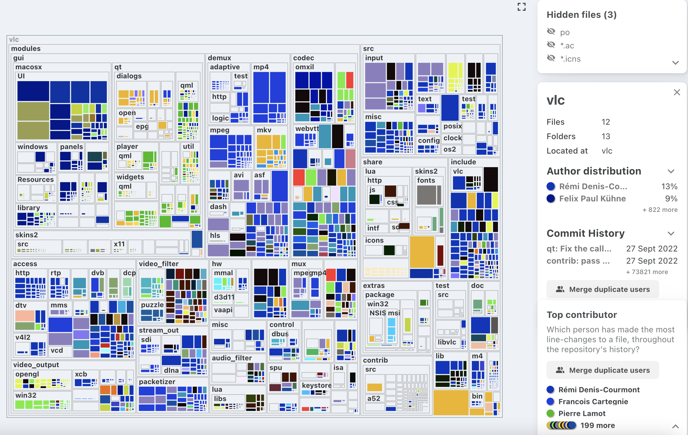
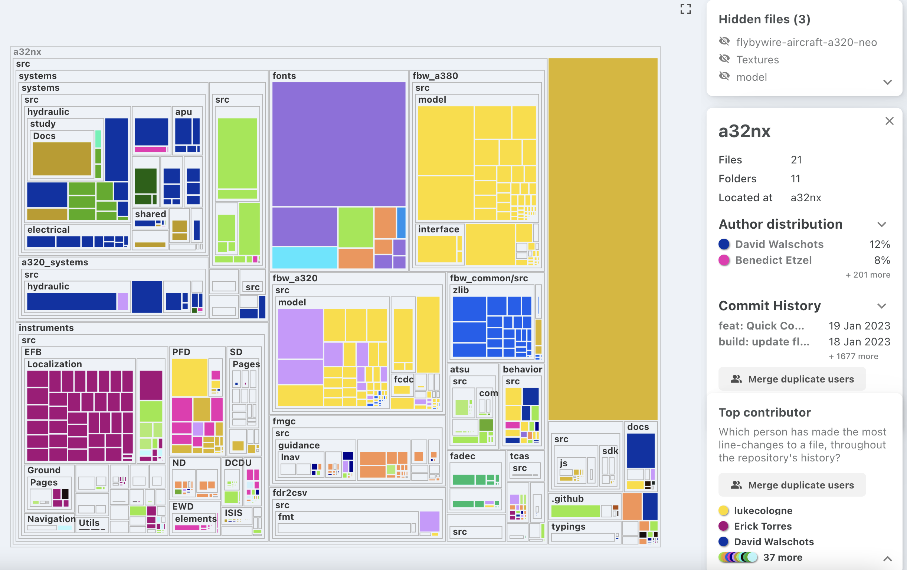

# Using Git-Truck to Copare System Complexity

I was in a research project defense in which two students were proposing to use as case studies for a certain empirical project two open source systems: VLC -- the famous video player -- and A32NX -- a fly-by-wire simulator. 

I quickly cloned them and opened them with Git-Truck. Lo and behold, it became very quickly evident that the two are not of the same complexity: neither in terms of size nor in terms of collaboration or commit history. VLC is really a monster. 

