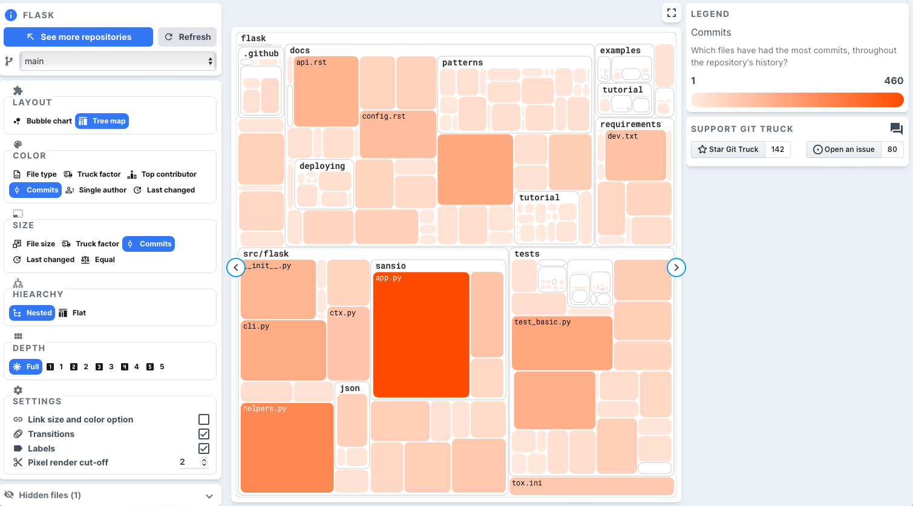
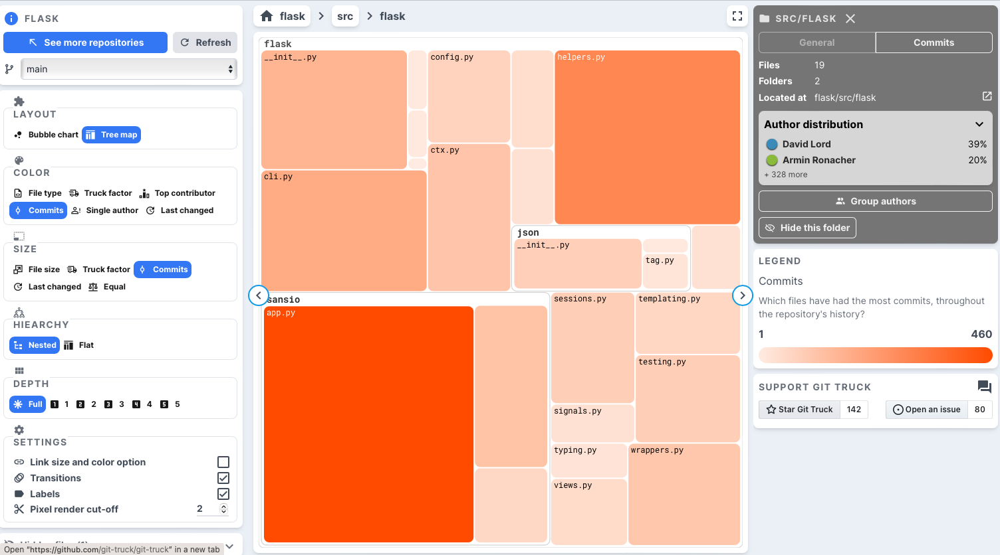
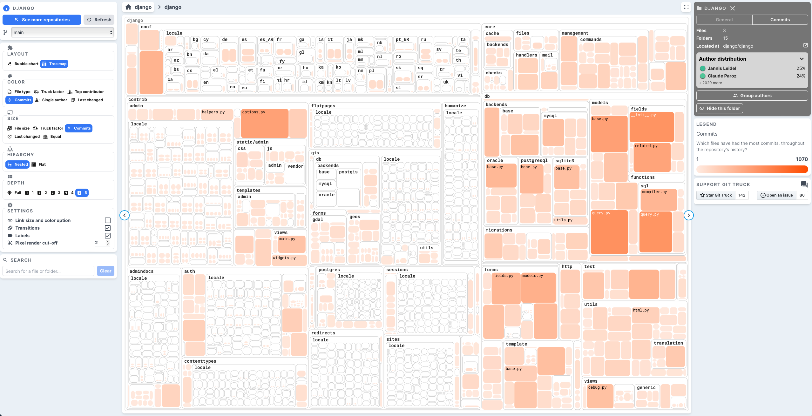

### [Git-Truck](../git-truck.md) / [Examples](../git-truck.md#examples-of-usage)


# Flask - Why Is it Called a Micro-Web-Framework?


In programming, we are all standing on the shoulders of giants. Our code always depends on other people's code. 

One such *giant* for Python web applications is Flask -- which calls itself a *micro web framework*. I always knew it was supposed to be a lightweight alternative to Django, but how much more lightweight was never clear. To analyze it we run: 

```
git https://github.com/pallets/flask.git
npx git-truck@latest
```

If we highlight the files that have a single author in the whole project we see that 
- very few files actually have single authors
- `app.py` - one of the main files (we'll see later why) has 133 authors

That's nice, looks like a collaborative project with apparently a low *truck-factor*.


Highlighting commits on both color intensity and file size we get the view below which shows that outstanding effort is made in changing the `app.py` file. 



In fact, the repository contains as much effort in the docs and tests as it has in the actual implementation. If we zoom into the `src/flask` folder we see that there is only a handful of files that make the project. 



It becomes now evident why the project is considered a lightweight project in comparison with the main web app alternative: Django, the source code folder of which is presented below.




To get the interactive view of Django run: 
```
git https://github.com/django/django.git
npx git-truck@latest
```

