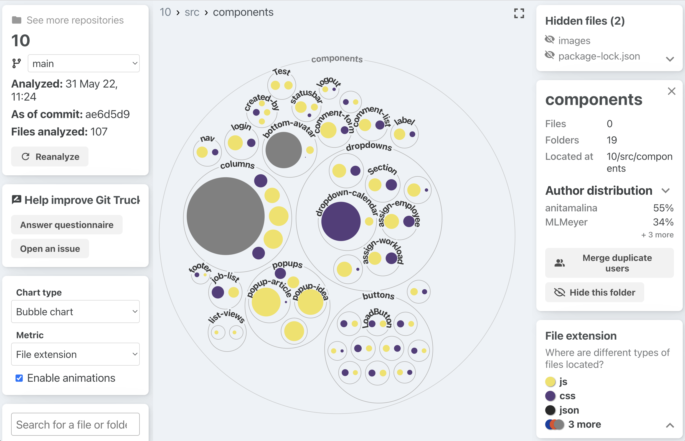

### [Git-Truck](../git-truck.md) / [Examples](../git-truck.md#examples-of-usage)

# Using Git-Truck to Understand Code Organization

You are looking at two student systems that implement react components. The view shows file type on color and file size on the area. You instantly see that the two systems have chosen very different strategies for handling their CSS: in one system a big CSS file styles the entire application; the other, a more modular system, keeps the CSS files close to the JS files that they style. 

