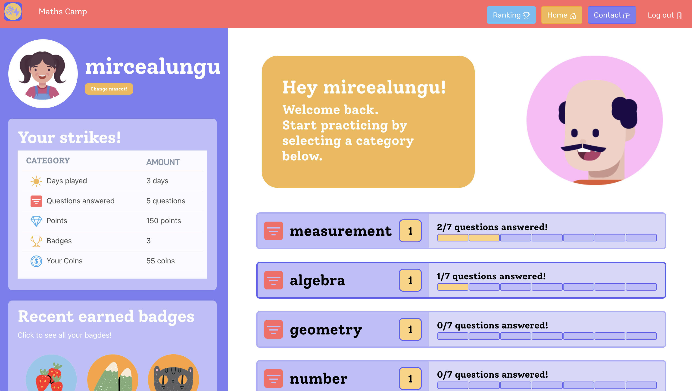

# MathsCamp - Personalized, adaptive, and social maths learning 

## History 

The project started as a collaboration with **Anne & Frederikke**, two ITU MSc students, and  [**Simona Tudoran**](https://www.linkedin.com/in/simona-tudoran-7a974a21/), a friend and maths teacher from London. She is really passionate about mathematics and teaching, and had many maths problems that she wanted to be able to share with students in an intelligent way. 

The current state of the project is the result of three distinct theses at ITU that built on the strengths of each other: 

- **Anne & Frederikke**, in their MSc thesis, designed, implemented, and evaluated the first version of MathsCamp and wrote about all these [in their thesis](../docs/assets/theses/AnneFrederikke--Designing%20a%20personalized%20learning%20app.pdf). The envisioned badges, avatars, and a playful design that was created by interviewing little learners :)
- **Tamara**, in her BSc project, [added personalized progress feedback](../docs/assets/theses/Thesis-Tamara-MathsCamp_Personal_Progress_Feedback.pdf) and studied it's impact on motivation. 
- **Mia**, in her thesis, [added a social component](../docs/assets/theses/Mia_Ronnelund_Thesis_2022.pdf): the students in a classroom can now see how are they ranking in comparison with a few of the neighbourly ranked students. A lot of thinking went into figuring out a way to ensure that the social component is encouraging. 

## Code 

The **code** is **open source** and available on GitHub at [/MathsCamp/MathsCamp](https://github.com/MathsCamp/MathsCamp)

## Application 

The following screenshot shows the user profile page of [mathscamp.org](https://mathscamp.org) as of May, 2024. 

