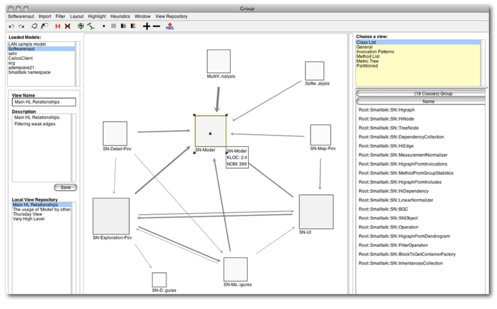
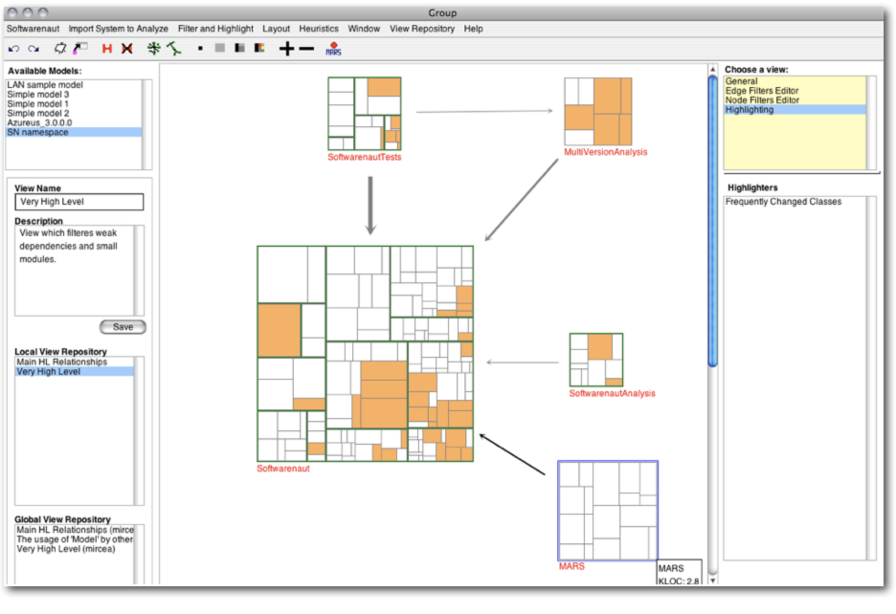
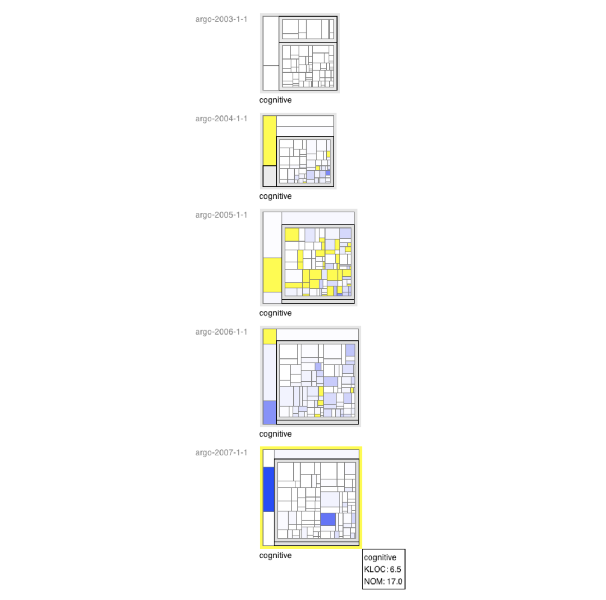

# Softwarenaut

Softwarenaut supports architecture recovery through interactive exploration and visualization. Interactive exploration, filtering and contextual details, are enhanced with evolutionary capabilities when versioning information is available.

- Source Code & Documentation: [github.com/mircealungu/Softwarenaut](https://github.com/mircealungu/Softwarenaut)
- License: MIT 

## A Screencast 

In 2012 I prepared a screencast of the way the tool looked at the time. I think screencasts are very important for research tools since they may give ideas to new toolmakers long after they tool does not compile anymore :)

<iframe src="https://player.vimeo.com/video/62767181?h=050cd80795" width="640" height="360" frameborder="0" allow="autoplay; fullscreen; picture-in-picture" allowfullscreen></iframe>

<a href="https://vimeo.com/62767181">Screencast: Softwarenaut for Architecture Recovery</a> from <a href="https://vimeo.com/mircealungu">mircea lungu</a> on <a href="https://vimeo.com">Vimeo</a>.

## Overview

This page contains a very high level overview of the tool. For details and case studies, see

1.  the journal article that describes the tool ([Evolutionary and Collaborative Software Architecture Recovery with Softwarenaut](http://scg.unibe.ch/archive/papers/Lung14a.pdf), [bibtex](http://scg.unibe.ch/scgbib?_k=mhZxW1Pf&query=Lung14a&display=bibtex))
    
2.  the conference paper that describes the way we visualized hierarchical clusterings of software systems ([Interactive Exploration of Semantic Clusters](http://scg.unibe.ch/archive/papers/Lung05aExploreSemanticClusters.pdf), [bibtex](http://scg.unibe.ch/scgbib?_k=v0zYApEK&query=Lung05a&display=bibtex))

### Aggregating low-level relations along a hierarchical decomposition of a system

Softwarenaut aggregates low-level relations along a hierarcical decomposition of a system (e.g. the package structure in Java). Softwarenaut can thus present a high-level overview of the architectural relationships between the modules in a system.

The figure presents the architecture of Softwarenaut visualized in Softwarenaut. The module sizes are proportional to their LOC and the relationships are proportional to the number of low-level relationships abstracted.

### Augmenting The Big Picture With Evolutionary Information

The following view presents Softwarenaut visualizing itself but this time, augmenting the structure with evolutionary information. On top of the architectural view we have highlighted the classes that have the most activity in the recent evolution of the system (as of February 2011). One can see that it is a minority of classes that have been changing.

### Details About Module Evolution

There are mahy module detail views which present information about a particular module. The Module Evolution presents a compressed version of the module history. The module is represented in every analyzed version as a treemap. When a new class is introduced it is marked with yellow. When a class changes it is colored with a shade of blue which is darker for larger changes. The figure presents the history of the cognitive package in ArgoUML.

### Coping with the explosion of information through filtering

Filters help coping with the explosion of information during exploration. There are two types of filters: entity filters and relationship filters. The Filters Panel allows the user to add and remove various filters during exploration. The filters panel appears instead of the Detail Panel when no entity is selected in the Architectural View.

Two categories of **entity filters** are:

-   Size Related: Filters all the modules that are under a certain threshold (Small Modules) or above a certain threshold (Large modules).
-   Evolution Related:

Two categories of **relationship filters** are:

-   Dependency Strength: they filters the relationships based on the number of low-level explicit relationships that are abstracted in the visible relationships (e.g. Weak dependencies, Strong dependencies). These are useful when starting the analysis of systems that have a large number of modules and dependencies between them.
-   Evolutionary: they filter relationships based on the evolution of the relationships during the lifetime of the system. Examples are: lifetime, newborn, old, new. They are available only when multiple versions of a system are loaded. They are useful for either limiting the amount of information at the first encounter with a system (e.g. lifetime) or trying to find problems (e.g. newborn combined with bidirectional).

