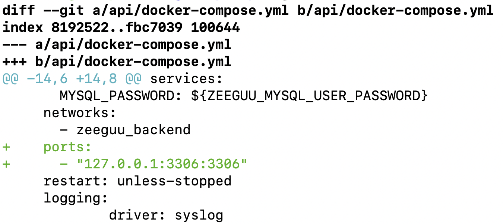

Jul 29

nginx needs access to all the path to a file that it would need to serve (somebody else [asking](https://unix.stackexchange.com/questions/491679/nginx-requires-identical-permissions-for-a-whole-path-up-to-a-directory-assets) about it on SO)

This is why, in zeeguu - I can't use `/home/zeeguu/data/` as root for the `/speech/` folder in the api site config. 

Current solution:
- keep the speech in the /var/www 
- overwite the volume mapping for /zeeguu/data/speech to point to the /var/www instead of it being together with all the other ones

Alternative, 
- provide fine-grained ACL to the www-data user to the /home/zeeguu/data/

Jun 28

Triple-track agile.
- discovery: backlog
- delivery: backlog
- beautify: backlog

Jun 27

indeed, the complexity of software creation does not compare with the simplicity to the scrum process. but i guess this is exactly why it's popular, because most people like to have certainties. and it's defined so high level that it can apply to anything.

Jun 26

good overview of [random forrests](https://www.youtube.com/watch?v=J4Wdy0Wc_xQ&ab_channel=StatQuestwithJoshStarme) 

gradient boosting explained by chatGPT:

1. **Weak Learner**: In gradient boosting, a weak learner is typically a decision tree with a limited depth. A weak learner is a model that performs slightly better than random guessing.
    
2. **Ensemble**: The ensemble is the collection of all the weak learners combined. In gradient boosting, each new weak learner corrects the errors made by the previous ones.
    
3. **Additive Model**: Gradient boosting builds the model in a stage-wise manner. At each stage, a new model is added to correct the errors made by the existing ensemble of models.

seems to me like it might be quite a good approach to overfitting? 

Jun 19

configuring a service in docker-compose such that it forwards a port to the host machine, but does not open it to the world: 

Apr 15, 24

The [voice of reason](https://www.youtube.com/watch?v=NUb61YMu1_o&ab_channel=DLDConference) shouts on the streets, but nobody pays attention. How is it possible that such an important voice is not listened to?

April 1, 24
#### Where do you save the password for mysqldump such that it can be run non-interactively? 

- in an envvars? Nope! It's called an EnvironmentVariable for a reason. It's about specifying the environment in which you work. all the libraries that your process uses have access to envvars - less secure than a file
- in a file - but then, it's in plaintext; anybody that gets access to your user account, can read them.

#### Which is safer? 
with the port mapping 3456:3456 or without? why? 

##### Which is safer? 

push from the old server, that I have since 2years to the new server?
or pull from the new server?
which one do I trust more? 
that one should keep the credentials to the other one. 

