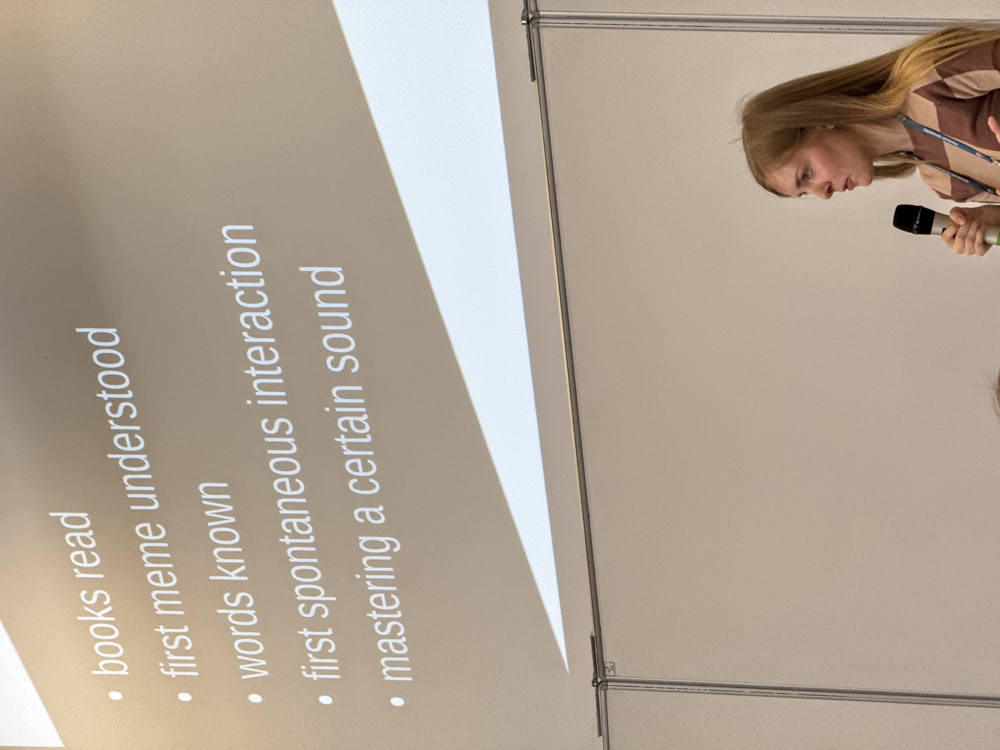
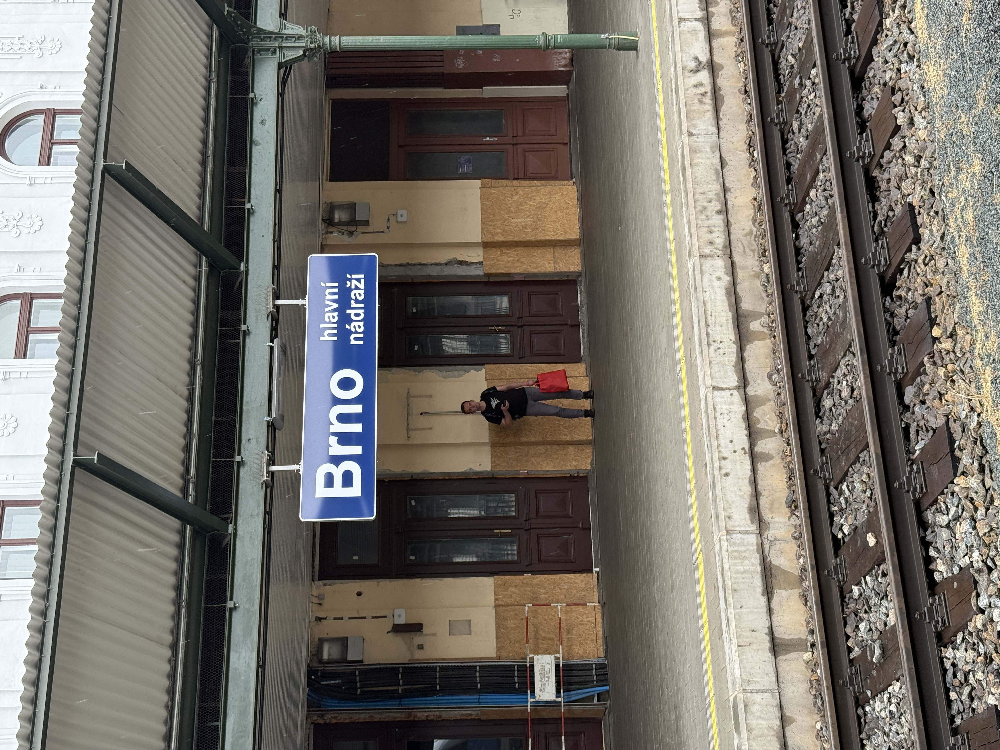

Aug 15

I realized something, in Zeeguu we could now, with the help of the LLMs, have the extension simplify any article in any language. Thus, if I really want to read about something that happened in Romania, I can still find the article, and then simplify it to my level, and then read it in Danish. This seems like such a brilliant idea. 

Then again, the whole development of Zeeguu has always been driven by these ideas that I have every now and then that I get very enthusiastic about. 


Aug 14

Working with Claude Code and Co. is doing the job of a Team Lead. You get code that you have to review. And not only that, but you get it from a *team member* who is quite confident, knows a lot of facts, but can be sometimes really wrong. You have to know a lot in order to be able to review it. By definition you can not do this if you're junior. 


Aug 13

Remember, never depend on a single API, especially if you're passing this onto your users. This morning Antropic's API is refusing to coöperate and throws an: 

- Error code: 529 - {'type': 'error', 'error': {'type': 'overloaded_error', 'message': 'Overloaded'}}

I guess it goes without saying that anybody who ever depends on an LLM, but then, also, on any API should always have an *API multiplexer* in front of all of them. Because, if you read their TOS you'll realize that their uptime, even if they promise 99.9% is defined in a different way than you would expect E.g. Google translate define up time in terms of service request requests not the actual time their service is up.  Also, they make it clear that if a call fails, you're supposed to do exponential back off. So if you combine these two things together, you realize that their 99.9 is a very different thing than what you think when you say 99.9 up time. 


Aug 10

In the context of Zeeguu we want to teach learners meanings. However, languages present a fundamental challenge: words often have multiple meanings depending on context. and also, a given meaning might be written in different ways. Capitalization can make the same word look like two different words. Sometimes, capitalization really distinguishes between two separate meanings (e.g. Lesen vs. lesen in German, or Polish vs. polish in English). And sometimes the same form of a word has different meanings. 

In the context of Zeeguu this is solved elegantly by the fact that we have context-aware translations. Thus, when we save a user translation to the database, we save the word/translation pair, and implicitly we disambiguate the meanings (Lesen/reading is going to be different from lesen/to read). 


Aug 9

A valid use-case for LLMs - the refactoring that you do when you get courage to start working on a codebase - you can do it with them and it's nice actually. 

The Claude could replace the lead dev / architect. And for small changes repetitive you might still be cheaper to work with humans. 

Erik Meijer - about how [vibe coding is sculpting in wax](https://x.com/headinthebox/status/1950031783581667686) as opposed to marble chiseling that is the traditional coding. I wonder if he works for an AI coding startup :) 


TID 
I can't speak for others, but for me, usability is a continuous, iterative process. I'm constantly engaging with the system, and each interaction reveals a better way to approach the design. Perhaps some people are skilled enough to think through all the usability considerations upfront, but that's not how I work.

Often, inspiration strikes at unexpected moments. Sometimes I'll have a breakthrough idea in the shower, right after I've closed the application I was working on. Other times, I'll be walking to the store house and suddenly realize there's an obvious improvement I hadn't considered before.

User feedback also plays a crucial role in this process. When users report bugs or provide feedback, it often makes me step back and question design decisions.

The key insight is that usability emerges through this ongoing cycle of building, using, reflecting, and refining rather than being something you can fully design upfront.


August 2

- Today Claude assumes that I have a `last_seen` column in my user table.
- I say no. But the ask if that would be a good idea. Claude reports that indeed some systems user such a pattern. 
- I think about it, realize that it might be useful, so I say okay, let's use it. 
- Claude comes up with the idea of updating the column on every authenticated request. I say that's stupid. It says OK, let's add throttling so we only write to the database if `last_seen` wasn't updated in the last N minutes. 
- I look at our use case and realize that for us, once a day is enough. So that's very little overhead. 
- Now, looking at my user table, it is very practical to have a `last_seen` column.

One way to use these tools is to learn from whatever accumulated wisdom they have captured from the Internet. And learn in the context of your own project, that you really care about. 


August 1

Claude Code transform you in the meta-programmer of Symonyi. 


Jul 31

Some days ago, I spent an hour, trying to fix a bug with vague notes for Claude.

Today, I thought well about what's happening, provided a few clear instructions, bug is fixed in five minutes. 


Jul 30

This technology is absolutely amazing for rapid prototyping—it helps you create prototypes much faster than traditional methods. But there are two sides to consider:

**The Competitive Reality:** This isn't just benefiting you—everyone else has access too. This creates downward pressure on programming jobs because everyone can now build products. What used to require a five-person startup team to prototype can now be done by one skilled person. The bar is rising: you have to become much better at what you do.


**The Cost Factor:** These AI tools are extremely expensive to use. You need to become really good at knowing exactly what to ask for. If you're vague or imprecise, the AI will go on lengthy tangents and produce poor solutions. You'll say "No, I don't like that solution," but then give another vague request, and it'll deliver another bad result.

It's like that classic story of someone making a deal with the devil—the devil always exploits vague requests and never delivers what you actually wanted. AI can be similar.


**The Bottom Line:** To use these tools cost-effectively, you must become exceptionally skilled at crafting precise, concise requests. Know exactly what you need and how to communicate it clearly. This precision will get you the results you want without burning through your budget on endless iterations.

The technology is powerful, but mastery lies in knowing how to direct that power efficiently. And to do this you have to write your own code. 

--

Seeing the little brother of my friend from high school grown into a large adult is shocking somehow. 


Jul 28

The more you rely on these robots, the more the companies, for profit, are going to have incentives to decrease their quality. Something as simple as instructing them: be 5% more sloppy, or 5% more verbose, on Mondays, etc. A bit like the cafeteria at my university where I suspect that, because we are paying by weight, they are incentivized to create food that is heavier. 

Also, if you're a company, you know your people. You have valuable people. You can count on them. But what makes you count on a company in SV that does not have your interest at heart? 

**

Maintenance. Talking to the guy at McD. Changing a screw. Painting a fence. Washing. Cleaning after the pigeons. He tells me about pigeons: "they are my main enemies; you wouldn’t be sitting here if I didn’t clean every day". People do not understand the importance of maintenance.

()()()()()

I swear that Claudius inserts little chaos in the code just to use more tokens! It just replaced a constant with a magic number! Then I have to tell it to revert it, and he agreed with me, commenting on how bad the magic numbers are. 

--

My experience is that when you want to do good for somebody, you often end up doing good for yourself. Is it also the other way around? Probably.

--

Is there a body specific weight? Moving a dumbbell that weighs 26kg from the rack makes me feel *fragile* . What should I be strengthening?


Jul 23

Our systems become so complicated, with so many rules, that even knowing the rules of the system is going to be as advantage.

**

LLMs as the magic mirror from Harry Potter in which you see what you wanted to see. 


Jul 19

Claude Code - it's awesome. But it tends to do what bad taxi drivers tend to do - drive you around on the longest path.


Jul 13

When you wake up in the morning, tell yourself: the people I deal with today will be meddling, ungrateful, arrogant, dishonest, jealous and surly. They are like this because they can't tell good from evil. But I have seen the beauty of good, and the ugliness of evil


Jul 12

What we might find out is that we don’t care that much about the details and that we just care about getting the thing done - it might be bad for designers. 

--

I worked hard my legs to solve the problems I had with my knees after last season of volleyball. Didn’t care much about the shoulders though. Now the the knees are fine but the right shoulder is injured. You have to take care of everything. 

The challenge of adulthood is the challenge of maintenance. Your body, your knowledge, your skills, your relations. Maybe this is what adulthood means.  

--

Maybe I finally understood what is hip shoulder separation.


-- 

We are all great remixers. who said this? 

-- 

I'm sure I heard this lyric in a song: "we remember the places that gave us the shelter to love". Still, all the googles and all the queries to the chatbots on the Internet can't help me find a song with that verse.

-- 

The opportunity cost of listening to music all the time is that you don’t get to sing your own songs. The opportunity cost of listening to podcasts all the time is that you don’t get to think your own thoughts. There is always an opportunity cost. 


9 jul

The fact that i have a deploy api button on the stream deck is just so satisfying. It's so amazing to be able to do a physical push of a button and then see it's impact in the digital realm :) I don't know why, after all, when I press a keyboard shortcut, it's the same. Still, the physicality makes a difference. I just love it. For now. 

** 

Reminder to treat the claude-written code as any student written code. Forgetful, incomplete, unaware of the big picture. 


8 jul

The kind of review i have to do with Claude is exactly the kind of review i would have to do with my own research assistants. Except that things are named nicely. So we spend less time on renaming things. Still, duplicated code, and missing abstractions are problems all of them have in an equal measure. 


5 jul

The brilliancy of working with Claude Code is that you can learn by example, in the context in which you care. 

** 

With Claude, everybody becomes an architect. The low level code is generative.

Also, your responsibility of introducing quality patterns in the code is super high. The robot is going to find patterns that you've used before, and copy them. Make sure that you introduce good patterns. It's like when you have a kid :) 

**

Eagerness is bad for you. If you add too much complexity without understanding it, you end up not being able to understand anything anymore from your codebase. You'll have to backtrack and start again. A bit like in a strategy game: if you expand too early, you lose. 


You still have to guide it to create clean code. It's generous with tokens, and happily introduces duplication.


25

Why work without the copilot? Because as soon as you will be hooked, it’s going to take home 20% of your salary… so if you can work without it, you’ll be able to make more money :) 


The three necessary societies: public life, domestic life, religious life. Russel Hittenger. 


24 

God gave us writing as a tool to see how shallow our thoughts are.

LLMs are another tool for God's same purpose. Trying to brainstorm with one of these one realizes the depth of thought that he didn't go into only after they start the conversation. 


23

When the cars are becoming even nicer as nice as ever to be driven we introduce self driving cars take the joy away but to make a bit more profit for Tesla. 

When the tools for thinking are better than ever, We are giving this Technology that promises to do the thinking for us. We should not take them. Unless indeed you have to commute for an hour and a half and live in the US and then you don’t want to be driving all the time? 


Who is gonna take responsibility when your agent does something that you don’t want?. Might be in the interest of open AI maybe or whatever anthropic to take the responsibility to encourage adoption a little bit like Vesa did with payments and fraud. Is just that there’s too many ways and use this ages will fail and they cannot take responsibility so they will not honour all the claims and then they will push back some of this onto the clients. And then at some point maybe people will realise again that it’s better to have a full automated system that is reliable and you can trust then a vaguely functioning system. 


jun 22


Today i had a task that was simpler to implement than to explain to Claudius :) 


** 

Mircea's law of agents: Never give an agent agency over things that you'd be in trouble if they could not be undone. 


jun 21

If you're in the "bullshit generation business"—creating trivial, low-value content—then you should worry. But if you do meaningful work, you should probably be happy because these tools can help you when used properly.

Always do the heavy intellectual work yourself—the thinking, the insights, the creative problem-solving. Let the AI assist with refinement, structure, and clarity.


Jun 20

Doing things dirty just to make them work was bad: that is what we called technical debt. Now you can do that at ten times the speed. 

The discussion of it amplifying the amount of code you write. If you write good code, it's going to make you write more good code. If you write bad code, it's going to amplify you writing bad code. 

**


LLMs as the wizard of oz technique. Use them to quickly prototype something. If the thing works do it again, but this time understanding how it works. 


** 


The existence of the coding assistants should really make those of you who want to program become much more serious. A few reasons. 
- if they help everybody write code faster, they will help talented people write code faster, and if you're the kind of person that writes buggy code, now you'll write buggy code faster; you'll suddenly risk becoming a net negative in your company; that's a risky future prospect
- if the coding assistants will end up being like auto-pilot for the planes, remember that for something that's much much much simpler than coding, we still need to have humans ready to take over at any moment; what does this mean about coding; we will hire fewer programmers, that can supervise the robot coder, and be ready to take over at any moment; that might result in fewer people needed, and that means that only the best will be hired eventually; 


the guy that was selling LLMs as software 3.0 the operating system of the future - bullshit. LLMs are chatbots, they are a very specific application. you can also use them as **non-linear, failure prone** components inside normal software. they are not an operating system. they are a niche application. a black box that can do many things to various degrees of shoddyness. For some reason, they can do a decent job at Software. 

But remember that the real world does not need that many such failure-prone components. Remember that the software that is making your life easier are systems that are automated, boring, reliable with well-understood, linear, deterministic components that can work completely on the device w/o the need to run for the internet, and with very little energy. 


Jun 19

Damn robots. They pretend they are philosophers too now! 


Jun 18

The ease with which *Claude Code* creates throw-away tools that would take me 1h and then it's ready to throw them away is fascinating. 


Jun 17

Tried Claude Code. It's fascinating to see it do things that a human would do. At an equivalent speed. Or slightly faster, but still being able to follow it. This is very different than any other computing system where you can't follow along. Here you can almost follow along. You can imagine the huge computation needs required. 


Jun 10

One doesn't discover new lands without consenting to lose sight of the shore for a very long time. (A. Gide). 


Jun 9

The attraction of the insects to the night light. The human attraction to the phone. 


Jun 2

Everything you do, do it with all your heart

Jun 1

"Small gods" by Pratchett - could be a metaphor for the "influencer" business of nowadays. Or for the stock market. Attention goes away, the influencer shrinks, the stock falls.


** 

Some observations on the way home from the polyglot gathering:
- Many youngsters attended because they saw an ad on Instagram. Short clips seem to be the way to reach a new generation.
- Cesco - has forty (!) volunteers for his project; he's highly social and driven; but still. He even had a good looking lady to manage his booth at the expo. This is how you do things.
- One peruvian software engineer showed me *"a website created by AI"* - a shell w/o a ghost. Fake dashboard. Missing images. But having some chat with a chatbot functionality included. He was proud of it. I tried to explain to him that when you're writing the code, you're also building your own understanding of the system. I'm not sure he got it. I asked him how is he going to maintain it. Then he agreed that it was going to be a problem... The *enshitification* of the internet is going to arrive at new levels. Not only shitty content, but now shitty web applications, where you'll have to spend some time to realize that there's nothing to them. Human curation is going to become so much more important. In a few years we'll be back to Yahoo! Directories and Digg or what was the name of that service.
- Two of them showed me chatbots that would chat back in translations. Is this a mode that makes more sense for the new generations? 
- At the expo, and during the conference I saw a few tools that were quite buggy, and where the ones presenting them were paying developers in India to create them. One where the language would be reverting on every other page. One where things were very slow... 
- There was one guy who annotated and aligned on his own 900 sentences between German and English. I congratulated him. I told him that I believe that "human-inside" as opposed to "ai-inside" is going to become valuable again in the future. 
- Brno company with 30-40 developers maintaining a multilingual corpus of sentence examples. Selling their corpus to universities as a business model. I'm so envious on that team size and the sustainability that it brings. This being said, complexity of the product is less than Zeeguu IMO. Less moving parts. 
- Girl talking about how do we even measure progress. No solution, just talking about the difficulty. I think we should really focus on this in Zeeguu.
- Talking to Dimitris - Latvian. Very good discussions. Including a promise that I'll send him a zeeguu advent calendar for December. 
- Multiple people are using LingQ (based on a discussion with a participant, who tells me that the creator uses the tool himself, and creates videos about it, I start to believe that it's the same guy as FluentU). They upload their own texts. Must study it again - and see what can we learn from it.
- The social program at the gathering is so much better than at our normal scientific conferences. No wonder that community is growing. Also, the price is so much lower. Why do we need such high price events in academia?
- All throughout the days, filming crews were making content outside. If you wanted to be interviewed you just went there.  The attention economy seems monstrous to me. Then at the same time, I'm also contributing to it. 
- I was one of the few Romanians. Multiple people came excited to me to talk in Romanian.
- One guy, asked me whether I could add more than one language translation in Zeeguu. I dismissed it. But maybe I should have not? Maybe it would be nice to try to maintain multiple languages? Then again, why? Does anybody try to actively maintain vocabulary in multiple languages? In that case it should be rather phrases, not individual words. 

** 
My Google Premium has expired. The level of ads is horrendous. I just hope that this is a way of twisting the hand of the people living in the rich world so they start to pay again and sponsor the poorer parts of the world. That, I could live with. If OTOH, they are just as nasty with everybody, then they deserve to be forgotten. In any case, for now, I'm happy for the decrease in watching that their policy resulted in. 

**

I guess everybody is using multimodal embeddings for content recommendation these days? You like a video version of *"eat liver stew before having rakia, so the rakia does not know which to attack"* on Instagram, and then you see variations, on the exact same joke but with liver pate instead... The new, do you want to find hotels in Vienna, after you returned from Vienna already. 

Alternative is that "content creators" (attention zombies, attention diggers, ...), see that a joke is successful, and they rush to create an alternative. 

** 


What if in the future, 

**Sat 31**

Nice discussion with one of the polyglots. The secret is in the effort. We're all making everything effortless, one-click translations, etc. But it does not matter - what matters is the effort. And back in the day, when you had to look the word in the dictionary, and you had to write it down in your notebook, you put more attention into it. And that's what mattered. 

Secret in life is focus and attention. And really attending to the thing that is in front of you. As children do. 

Another one: war in Kanton Bern für zwei Jahr arbeitung mit Beton. Zu viel stress. Sehr tiefe Stimme. 

Another polyglot had a chatbot that would translate sentences in conversation with her friend in Italian and German for her practice. Would it make sense to have something similar for my own translations? 

**

If you have a principle, but you make an exception it will be much easier to make an exception again. Until it's not a principle anymore? 

**

Presenter talking about how we measure progress:  




Words known - “I don’t want to go into the question I’d what a word is”. So true :)

Do you track every meaning? 

Passive and active knowledge?

My idea — 


May 28

Morning burpees are hard. Harder than Romanian deadlifts.

**

Breakfast at the PG hotel. “Do you want a Prosecco?” Sure. That’s how I like to start my days.

**

Obsidian is such a pleasure. Being excited about a text editor. That is special. 

** 

So easy to see the silliness in somebody else’s idea. Research idea. App idea. Startup idea. But your own, they are brilliant. *Fățarnicule, scoate întâi bârna din ochiul tău, și atunci vei vedea deslușit să scoți paiul din ochiul fratelui tău*

**

We should add an “import your streak from Duolingo” feature to Zeeguu :)


May 27

Pete Seeger. I love several of his songs. But man he does have too many! I’ve made the mistake to add all his to my liked songs playlist, And now it’s 10 minutes since I keep deleting them and they still are some more. I guess I didn’t find a way to delete many of them at the same time. I have to delete the one by one. But still. 

**

Czechia - I don’t understand anything from this language. I should love to learn some Slavic language. I’m quite sure knowing one helps with all the others. 




**

Mendel university. In Moravia. 


**May 23**

Politicians - “Europe should invest more and start more startups”. But this is copying the US, and we're starting too late. What if, in Europe we could go the other way? We could go for quality. Not fast stupid ideas, but high quality deep ideas.

**

On the translation of programs from left to right - Knuth


**May 15**

Such a pleasure when you finally name your concepts well in your code, and the code becomes suddenly easy to read and think about. 


**May 12**

Life goal: be able to distinguish between all the Beethoven's Symphonies. 


**May 11**

As an web app developer you're a generalist. You're the ultimate renaissance woman or man. Reminds me of the quote of Heinlein: *"a man should be able to: plant a tree, change a diaper, write a book, plan an invasion; specialization is for insects"*.  


**May 10**

Beautiful historical churches should be transformed in Farraday cages. They should be places of meditation, where you could escape from the internet for a moment. Keeping you away from Satan. 

**May 9**

Your duty as an academic maintainer of a software is to define the architecture, the borders of components, the interfaces. Everything that is done by a student, should be defined, circumscribed by an API that you defined, by an interface that you designed. That way, if later you need to replace it, you can replace only that component. In an ideal world.

Or you do the coding, and they do run the studies. 


**May 7**

Can you get on a dopamine rush fueled by creation instead of consumption?


**May 6**

That habit of the Americans to strike a conversation in any situation. That is cool. 


**May 5**

Goal for the second half of life: transform the beauty, enthusiasm, and strength into kindness, wisdom, and efficiency. 


**May 2**

I can love all people, but I cannot love all cultures. Large man looking stiff and slightly angry muttering obscure religious chants to himself loud enough to hear him from three meters away.  

** 

Programming as an never ending refactoring towards clearer and clearer concepts of the problem domain. 


**Apr 26**

Yeah, they are *stochastic parrots*. But the quality of conclusions one can derive from a  conversation one of them, and the common sense life advice one can distill from such a conversation is impressive. 

**Apr 25**

You should follow the “*no broken windows*” theory in your own life. 

** 

James P. Carse: the valuable games are infinite ones, not finite ones. 


**Apr 24**

Sometimes we relive the story of the prophet Jonah and his overnight attachment to the leafy squash plant. We attach quickly to an idea, a person, a possible future. And when it’s taken away, we suffer. 

Are we like kids who do not want to go home from the playground? Did we fall in love with this idea, with this possible future, so much that our feelings are kicking and screaming at the thought of having to give it up? Even if a little while ago, we didn't even know it existed? 

Or did we maybe make an intuitive recognition of genuine value or compatibility?

Gnosce te ipsum. 


**

It’s good to have a local version of an LLM. Your own little black box with a compressed internet that you can consult even when on a plane.


**Apr 21**

The smell of spring in Arad is different than anywhere else for me. And teleports me to childhood.  

** 

Dune. Dacia. Two typeface designers; same idea.

**

Online course idea: *Teach yourself Linux in one year, 15 min a day.* As a conversation between me and somebody who does not know anything about Linux. Would I know enough about Linux? 


**Apr 20**

Once you step outside of a given context, you can see the cracks in it.

*There is a crack in everything, that's how the light gets in*. 

** 

Life vs. artefacts.  Buildings vs. Communities. Individuals vs organizations.

Is there a higher aim for a creator than to create something that's life-like? 


**Apr 15**

KØBN HAVN LUFT HAVN = Shopping port air port. 

** 

In BUD airport, watching a man and a woman take turns at doing an islamic prayer. Carpet to the wall. standing. Bowing. woman does the prayers. He films her. When she's done he does the prayers and bows. They are trying to attract the benevolence of their god i guess. It looks so out of place. So medieval. Though I guess somebody else would find similar medievalisms in various flavours of Christianity. I guess it's always easier to see the limitations of somebody else’s religion.


**Apr 14**

What if LLMs and robotics merge to become tutors? Uncanny valley? Does not need to happen. We we can stop before.

VR and LLM? Whatever works to do the reps. 

**

Jeffrey Sachs, John Mersheimer, as some kind of spies that the enemies are happy to welcome in their midst because they speak against the US? If there is so much deception in a board game like BoTCT, there has to be some also in the real world?


**Apr 13**

That missing word to describe the joy of realising one afternoon that Scandinavian winter is over. You go away from work and it’s not dark anymore, but rather you can see the sunset.

I keep asking my local friends whether they have a name for it and it seems they don't. They should. 

**Apr 7**

The personal and subjective value of a relationship can be computed as integral over time of the quality of the relationship.


**mar 31**

We don't need to write anymore, because we can type. 

We don't need to type because we can dictate. 

We don't need to read because we can listen. 

We risk becoming illiterate as a society. 


mar 30

For many things, the chatbots are replacing search. Only that they extract exactly the knowledge you're after from the net, and they help you avoid the insufferable and innumerable ads that litter the web. 

For now they help you avoid the ads. For now,  [like everything else](https://www.youtube.com/watch?v=C_cB9sSswpo).

Soon the ads will follow again, displayed on the side of the chatbot answers. Just as YouTube was a relief from the TV ads, only to become even worse once it stole the market of TV.


mar 28

Reading about Popper and Hayek who established the *Mont Pèlerin Society* to work together and promote freedom, I'm reminded that if you want to make an impact on the world, you will  have a better chance if you ally with likeminded people.


mar 20

fast food. bad for your health. not today. but in the long term. 

fast code. bad for your business. in the long term.

fast dopamine. bad for your life. not today. but in the long term. 


feb 16

Geopolitical Analysis: The Ukraine War, US-Russia-China Relations, and Europe's Position

My take on what's happening in the world is the following:

1. US realized that the the Ukraine war has pushed Russia close to China. This gives China cheap energy, something that makes them an even more dangerous economic  competitor to the US, and thus an enemy. So they want to undo this proximity between the two Asian powers. The surface idea seems to be to try to negotiate with Russia? It is not clear why Russia would trust the US now. Then again, they don't need to be asked to trust, the US can simply provide more openes to the east. US retreating from eastern Europe might be all that's necessary to give more "breathing space" to Russia and decrease their dependency on China. 
2. The war has weakened EU. 
	1. In a sense, i don't think the US is sorry about this. US as a hegemon is afraid of anybody who might be a number 2 and challenge them. European economy was also a strong competitor. This is where the fear of Europe approaching Russia stemmed from in the first place: the famous hearthland theory -- whomever controls central asia controls the world. And thus, the only worse thing than europe working in collaboration with russia is an europe-russia-china euro-Asian block. This is what the hearthland theory claims to be the secret of world dominance. 
	2. There is another sense in which, US is also not happy about the weakening of EU. If their allies are too weak, they are not useful. So from this point of view, it might actually be that US might be interested in allowing and encouraging at least a limited rapprochement between the Russia and Europe. However, Europe is prisoner of its own propaganda at the moment. The US had it easy: it simply put a new face at the helm and they can now "pivot". Then again, it might be that US profit from the stalemate in Europe. In a few years, when the war with China starts, EU will have to fight RU.
3. Ideally for the US what they would be want to achieve is a limited decoupling of Russia from China by allowing Russia to have some "breathing space" in Europe; while at the same time, making sure that too much integration between Europe and Russia is still avoided.
4. The most important thing for US is to be able to fight a war with China. It's worth remembering in its doctrine of war, US makes it clear that they are allowed to start kinetic war against countries and actors that threaten their economic interests. Starting a war with China, would also allow the US to cancel all their debts to China, which would be quite a nice side-effect. 
 

"America has no permanent friends or enemies, only interests" Henry Kissinger.


feb 15

Containers - making a process believe that it has the whole OS for itself.

VMs - making an OS believe that it has the whole hardware for itself. 


feb 14

Somebody should do a series of empirical studies on "*the law of leaky abstractions*" -- e.g., in projects that use ORM, how often can one see the underlying database coming through; in projects that use terraform, how often do they have to use the strange ad-hoc provisioners that allow them to fall through in 

another law that somebody should formulate: any "proxy"-like service, e.g. one that promises to interface to many similar ones (e.g. vagrant, sqlalchemy, xamarin), etc. is bound to evolve much faster than any of the individual ones. from that POV, if one wants to be more sustainable, it would make sense to learn a stable technology and use that rather than use the abstraction. a way to quantify this would be to look at how often did SQL change over the duration in which SQLAlchemy, or other ORMs

**

Looking a bit at what is happening in the US. What's happening is probably explained by the *"hard times make strong people, strong people make good times; good times make weak people; weak people make hard times"* addagio.

The "monopolar moment" has made it so easy for the US to coast, and think that they can behave with impunity in stupid ways: have senile presidents; toy with post-modern meaninglessness as an ideology, call continuums binary and call binaries continuums; intervene anywhere in the world without thinking about consequences, hire babbling vice-presidents to give meaningless discourses; print money like it does not matter. 

However, as I was saying somewhere below on this blog, because of the raise of china will make them wake up. And as far as I can tell, they seem to be waking up. Seeing the discourses of the current VP, of the secretary of defense feels like realist people are back at the helm. 

The EU is a different story though. It's a herd of cats and much too easy to *divide and conquer*. 


jan 30

should one invest in apple in a.d. 2025? 
- yes. technology, hardware and software well done are still going to be important ten years from now. and the leadership position is going to be hard to beat. ; 
- no - the fragmentation of the whole world into two spheres will limit the "growth" that the markets are looking for. apple won't be able to keep growing anymore. also, as usual... the chinese will come and hit them strong (e.g. xiaomi, huawei, et al.). Still, their ecosystem and network effect is going to be with us for the long term. 

The quality of their product? They really create seamless integrations and slowly keep innovating. And though they have small problems at the edge of their software offering - e.g., the fact that T's music account was still in Switzerland because it was associated with some inexistent credit card info from 10 years ago (!?) overall they still produce some of the highest quality software / hardware at the moment. Including the wonderful assistive mode that i use for T. 

So as of Jan 30, 2025 AAPL is a buy for 1 year, 5 years, and 10 years. 


jan 29

the mind can be either a producer or a consumer. be a producer. 


jan 7

you have such a great responsibility when you're naming things: listening to my team having to use the term "bookmark" for a translation, and not being able to change it because it's so deep in the system that it would be too much effort. 

** 

we are all tempted to come up with technological solutions to social problems. we do not see it in ourselves, but it's so easy to see it in others. you look at them and you think? why do you do that? it's not needed. however, your own idea-of-software-that-the-world-needs  are absolutely essential and if they happened, they would make the world such a much better place. 


jan 6

ruy-lopez, the schilieman variation - looks quite nice. must try it :)

jan 1

Watching Daniel Naroditsky commenting live a game with somebody around my level on chess .com. It's a thing of beauty to see an expert do his thing. He takes all his time to explain how he thinks and even explains alternatives too. 

Should we be doing the same with programming? Frontend development has quite a bit of complexity. I wonder, whether various front-end patterns would be as interesting as the chess openings and the various lines. 

dec 30

restarting to read thomas mann - joseph and his brothers - because I want to find a quotation in it. somewhere a character, and I think it's mai sakhme says something along the lines of: 

> only stupid people are surprised in life; the wise can not be surprised because they have thought about all the possibilities

i would like to adapt it to becoming angry. you become angry when you are usually surprised by something that you don't like. somebody cuts you in line. the food is too late to arrive. somebody does not do what you would like. if you got angry it means you were stupid: you did not think this possible. 

reminds me of that story with the dalai lama being asked: "if you could time travel and sit in a cinema near hitler, could you avoid getting angry and killing him?" answered: "yes, kill him, but don't get angry". 

** 

First time i read the novel was in Romanian, and thought it was absolutely brilliant. am curious how will i feel about the english translation. But it's already promising... look at the beauty and irony of this passage: 

> "Flower of the Two Lands," he said in voice of surprise, "whose beautiful face has a place in the house of Amun, who is alone in her comeliness when her pure hands bear the sistrum and when she sings in a voice beloved by all." He maintained this tone of happy surprise as he hastily recited the formulaic phrases. "You who fill this house with beauty and to whose grace all things pay homage, you who are the confidante of the queen—you know how to read my heart in fulfilling its wishes ere they are spoken, fulfilling them by your very coming. Here is a cushion," he said in a more prosaic voice, pulling out one from behind his back and arranging it on the ledge at his feet. "May the gods grant," he added ... 

or: 

> "To remove Osarsiph... My good woman, this cannot be, banish it from your mind as an absurd, totally whimsical request. I cannot allow the idea to join my other thoughts, for it is alien among them and they all rise up against it in greatest indignation."

and the length of this phrase: 

> When one considers that she had to struggle alone and without help, unable to share any of this with anyone other than Dûdu, and even with him in hints and words that hid her confession—or at least not at first, for later she cast aside all restraint and made the world around her a participant in her madness; when one also considers that the anguish in her blood had led her to choose a man who had to defer to the higher cause of a jealous God and wore in his hair an herb of faithfulness and arrogance-or, in a word, of his chosen state— and that he neither wanted nor was allowed to yield to her temptation; and when one likewise bears in mind that her agony lasted for three years, from the seventh to the tenth year of Joseph's sojourn in Potiphar's house, and that even then her torment was not allayed but simply slain—then one must admit that the fate of "Potiphar's wife" (popularly regarded as a shameless seductress and the honeyed bait of evil) was not an easy one and at least grant her the sympathy arising from the insight that the implements of such a testing carry their own punishment within them, bearing a greater share of it than they deserve, even if we admit the necessity of their function.

or this: 

>Does one carry a mummy through the banquet hall as an admonition to end the feast because all is transient? No, just the opposite. For upon its brow is written: 'Seize the day!'" 

or:

> For instance, he had more than enough to do just fending off the presents she had been trying to shower upon him of late—moved, as she was, by that ancient and **forever lively desire of those who love, which is rooted in feelings of dependency upon the person whom they have made into a god, to offer sacrifices, to glorify and adorn them, to woo them with bribes**.
> And that is not all. The lover's gift also acts as a means of claiming and seizing possession, it serves to brand the person loved before the rest of the world with a protective symbol of ownership, to clothe him in a livery that says he is no longer available. If you wear my gift, you are mine. The finest gift of love is the ring—whoever gives it knows perfectly well what he wants and whoever takes it surely knows what is happening to him, for the ring is a visible link in an invisible chain.


nov 17

Symphony 5 in C Minor - 3rd movement -- majestic and sweet at the same time. 


nov 12

Just read a goodreads [review of "the last kamikaze"](https://www.goodreads.com/review/show/1502319715?type=review#rating_730310365) that I wrote in 2016 when I read the book. I don't remember anything from that book. I read the review, it sounds like me, but I don't remember the details from the book. 

What's the point of reading so much if you don't remember anything from a book? Maybe *less is more* is also true for reading? My grandma read the mostly one book, the Bible, but she read it so many times that she could recite full chapters. I read probably more than a thousand books by now, and I do not remember almost any paragraph by heart. None of the two approaches is ideal. The middle way probably would probably be best. Maybe we should all create our own Bible -- from gr. *biblos* = library -- a collection of books that we read and re-read because we find them valuable. 

nov 3

Reading an article entitled [the left has forgotten its phylosophy](https://unherd.com/2024/11/the-left-has-forgotten-its-philosophy/) and i'm thinking about the following... 

The left used to care about the dispossessed. And the left was powerful because it would normally have on it's side the energy of the youth, who, by definition are the ones who should want equality for everybody, a natural consequence of the fact that they do not have yet power and would like to share. From whence also the adagio: "*if by 20 you're not a socialist you don't have a heart; and after 40 you're still one, you don't have a brain*". 

However, this side of the century, the youth are not fighting for the dispossessed anymore. Indeed, there still are some relics of the traditional left who care about economic equality, e.g. the eternal Bernie Sanders, but most of the youth are not focused on that, but rather, on the politics of sexual preferences, gender self-perception, and skin-color intersectional identities. A vague political cause, that is trying to figure out exactly where does it want to go and whom does it want to protest against. And in the process it dissipates the force of the youth. 

Compare that with the alternative scenario in which the young generation would target its protest at economic inequality. They would have rightful reasons for anger -- so many of them are worse off than their parents already, have falling life expectancy, and the outlook is not brighter for the future. In fact, many of the people in the older generations would definitely join them as the 99% share of economical wealth has been constantly declining to the benefit of a handful of individuals. Indeed, Gates, Buffet, and Bezos have more wealth together than half the country. The most powerful country in the world that is. 

At the first sight, this is a wasted opportunity.

But at a second glance, this is a good thing for the *stability* of America and more generally the west. It is not clear that the politicians could deliver more economical equality or that they would even be interested in doing so given that they are already part of the beneficiaries of the current system and the rich are also too powerful by now. 

So in some sense, the youth who are supposed to be liberal are doing the conservative job of preserving the status quo by not focusing their energy on fighting for economic equality. And maybe it is for the best after all? Maybe it's a feature not a bug? After all, when the young communists got to power and had their chance to impose *equality*, the world did not become a better place.


oct 30

second day of water fasting. in the evening i go to volleyball training. I was a bit worried, but I completely forgot that I was fasting. i did a few super nice attacks, i felt like I might be spiking a bit better than normal. especially my timing seemed a bit better.  i love this game.


oct 24

Christians used to think of God as a great king (king of kings) or a great lord (lord of lords). Not surprising: every age has it's own idea of who's the most powerful in the world. In the past military might was the epitome of power. Now, we seem to believe that it's creative power. With our current understanding of the world, it's much more likely that the most powerful being we would imagine would be something like a physicist of physicists or hacker of hackers. Or physicist-hacker of physicist-hackers. And this is because the dominant metaphor of our age is computation. Thus, we imagine the whole universe as a "simulation inside of a computer". 

If one thinks of God as hacker, they'd probably imagine an interventionist god: stop the execution of the universe, make a change because something seems wrong (or because one of the protagonists asks *with all their heart*?); then restart. A bit like a Smalltalk debugger: pause, change, continue. 

If God was a physicist, he'd be much more about running multiple simulations. Because how could he ever decide that a given state is bad without having left the simulation run till the end? So he would owe it to himself to let our timeline with the holocaust run to it's completion just to figure out whether that local maximum of suffering might not be the seed of future good. Just as he owes it to himself to run a simulation w/o Hitler reaching adulthood. And one with slightly different speed of light maybe too.

Assuming he's a hacker-physicist that wants to minimize suffering in the universe he's created, which would be the only thing would make sense for us anyway, does he not owe it to himself to run an infinite number of simulations? Maybe, but it's very likely that even God's infra would not scale to that. He must be pruning some of the timelines early if they end up being too miserable. So in a sense, if every one of us would try to minimize suffering, maybe we'd help him just a bit along in his sysyphian quest? 

This is getting too complicated a model. I think it's easier to think of a king of kings after all. 

oct 18

Thomas Seyfried talks about 1) Ketosis and 2) Albert Schweizer in the same video. Two of my favorite topics in one talk. 

**

Will GenAI increase the importance of unit tests and contracts? In principle, the more tests you have, the more contracts you have, the more confident you can be that the generated code might actually do what you want. Although... the devil is always in the details. And the bugs are always in the corner cases... 


oct 17

We've tried outsourcing software engineering to the east. It did not work, because we realized that it takes so much time to specify something precisely enough for it to be implemented that we might just as well implement it ourselves. Did we learn something from it?  
  
Nope.  
  
Now we're hoping that we can "solve" software engineering by outsourcing to the west: the capitalistic magic black box that has ingested the whole internet will surely be able to take our wishes and give us for cheap programs that do what we need, even if we don't put in the effort to specify unambiguously what we want.  
  
Nothing is new under the sun.


oct 10

in the US.

crossing the street in front of one of the (monster) trucks they casually drive there.
the first time in my life i feel afraid to cross in front of a stopped car: what if the driver does not see me. so i rush to the other side. 

sep 29

natural language (ambiguous) running on LLMs (non-semantic / non-deterministic? machines) will never replace programming languages (non-ambiguous) running on vms languages (semantic, deterministic) for any of the tasks for which the latter are good at.  


sep 27

homo sapiens. homo faber. homo ludens. you can't have one without the other. or you can, but it's not fun. or stupid. 

sept 20

morning swimming in the sea. it's cold.
makes happy. and wakes one up better than the most Italian espresso.

sep 13

everything ends. even the universe. the ultimate melancholy.
or schadenfreude.

alternative to everything has an end is "everything changes".
from the Octavia Butler's Parable of the Sower. Where there is this religion where people worship Change.
because there is nothing else as eternal as change.

sep 1

we have writing to see how shallow our thoughts are.
and we have programming too see how shallow our writing is

Aug 26

quite unintuitive, but the resting energy expenditure of our bodies increase when we fast, and this effect can be seen for up to four days even. ([scientific article](https://pubmed.ncbi.nlm.nih.gov/10837292/)). Although at a second thought, it's not that unintuitive: the person needs more energy to find food! ([more elaborate discussion](https://www.dietdoctor.com/does-fasting-burn-muscle))

Aug 21

- hermeneutic spiral - https://youtu.be/qKJP93dWn40?si=InwMKPrP07RM7TPI - you must go around a problem a few times before you solve it.

- sometimes slow is better than fast: https://youtu.be/Bc9jFbxrkMk?si=lAOmQiLfZJ1Lxl2J
  - good discussion also about speeding when driving

**Aug 15**

People watching in Bergamo, Piazza Vecchia.
Each one of this people - an inner world that i.m oblivious of.
Each one carrying with them thoughts that ill never know.
Except the old man that stops to tell me about the _citta alta_ of his youth :)

**Aug 9**

So easy to judge in others what i indulge in myself.

**Aug 8**

Ludwig Wittgenstein: „Where others go ahead, I remain still”.

Also L.W.: "_we must follow our conscience, while also accepting the world as it comes to us_".

\*\*

Schopenhauer (...) whose ethics consists simply of extinguishing one’s own desires while trying to reduce the suffering of others. [source](https://mostlyaboutstories.com/wittgenstein-at-war-his-early-ethics-and-two-extracts-from-his-diary/).

**Aug 2**

China learned from the west to use markets. The west will have to learn from China to give more power to the governments. You can't hope that some for profit company from a different country is going to care about the long term of your own infrastructure.

**Aug 1**

Most scholars agree that Mark was the first of the gospels to be composed and that the authors of Matthew and Luke used it plus a second document called the Q source when composing their own gospels. Although it is debated, [marcan priority](https://en.wikipedia.org/wiki/Marcan_priority) seems to be most plausible.

**Jul 29**

Morning coffee discussing with my father a quote from a book: _"In our culture people put more effort in the job than in the family"_. We both agree he didn't do that; he put family first. Good? Bad? Who knows.

**Jul 28**

My answer to the two questions from the [interview](https://youtu.be/qRY-foz-ZAw?t=2364) with Robert Waldinger on happiness:

- **Why are you alive?** To make the world ever so slightly better.

- **For what are you willing to die today?** I can list people for which I would die. I don't think I would die for an idea.

It was interesting to see the answer of the host to _"Would you die for your country"_? Nope. I wrote about this before: I don't think our generation is ready to die for the abstract concept of a nation anymore.

\*\*

If you do your work because you want to serve. Remember to always ask: _Is this going to serve?_

\*\*

Evening, after big dinner in town, I still have strong cravings for sugar. This can not be my brain. This has to be some bastard bacteria that in my gut that are pulling on the vagus nerve. My brain can't be so stupid... can it?

**Jul 26**

The elites in the US have had it so easily that they started this meaningless attack on meritocracy. If they are to stay relevant, they have to reverse it.

**Jul 24**

I heard that Bobby Fischer had this principle in chess: do not let the opponent's piece linger in your half board. As soon as it enters, as soon as you kick it out. I like that.

**Jul 20**

Lunch with L. Realizing that making choices is hard when they fall outside of an overall goal. As per Alice in Wonderland: if you don't know where you're going, any way will do.

**Jul 19**

Seeing a 3yo watch cartoons is a thing of wonder: the wide eyes, the 100% focus. How much would I be able to learn if I had the same focus?

\*\*

_Marvin, das Steppende Pferd_ in German saved me from doomscrolling in during the 2008 economic crisis. Could it be that in 2024 _Gurli Gris_ in Danish will save me from reading and watching materials about the upcoming third world war and economic disasters?

\*\*

Day #2 of fasting; 18.30: 8 pull ups?! on a normal day I do 5-6!

**Jul 8**

There's somebody near me in the plane with an IronMan bracelet, and it reminded me that I always admired people who finished such a race. Maybe one day I'll do one too.

\*\*

So many things to do, so little time.

\*\*

Reading Heretic by Ayaan Hirsi Ali. What an alien religion is Islam. The funny thing is that I'm sure for them, christianity is just as alien. In fact, I remember discussing religion with S., a friend who was really amused at the idea of Jesus being the son of God. How can God have a son? In any case, the book by Hirsi Ali is a reminder that Islam is in dire need of a reformation: the combination of literalist interpretation and warlord-period inspired ethics does not fit in the modern world. Unfortunately, I think Ayyan is _preaching to the choir_.

\*\*

Discussing with M. yesterday: what if Calvin is right, and in a Loki-_esque_ manner, The Creator has endowed some humans with the capacity of feeling spirituality, and some others without it. Now the two groups can contradict each other forever without any of them being able to understand the other.

**Jul 6**

Stallone: _"I wanted to at least have the opportunity to say to myself, well, you tried"_. (https://www.instagram.com/p/C8KX5q1x2hB/)

**Jul 1**

Under the starry sky, at night, in the mountains.

From Kingdom of Heaven: _What man is a man who does not make the world a better place?_ The beauty of this, as a philosophy of life is that, no matter who you are and where you are, as long as you still _are_, you can try to live up to it. Obviously it's unfinished a philosophy of life, because it's dependent on what one understands _"better"_ to mean. But maybe in combination with Schweitzer's _"life who wants to live in the middle of life who wants to live"_ it could become a moral code? I guess first implication would be vegetarianism. And a more advanced implication would be the buddhist monks who are afraid of even stepping on an ant?

\*\*

Might it be the time that I travel more to the mountains? And I should really start writing down a list of my hikes?

**Jun 28**

On repeat today: Soy, by Gipsy Kings.

\*\*

Arm(airport)chair geopolitics:

- In the US doctrine of war it stands written that: US is allowed to respond **militarily to any entity threatening its economical interests**. It does not make much difference if the threat is intentional or unintentional. Any entity that threatens the us economy will have to back down or explode... it does not matter that it is a currency, a gas pipe, a dictators, or a democratically elected leader ... economies can sometimes back down voluntarily (e.g. japan), gas pipes get delayed or explode; dictators rarely back down voluntarily:

  - the easiest is when the entity backs down: Japan devaluing their currency
  - another easy solution is when the entity explodes and nobody wants to figure out who is responsible for the explosion;
  - the hardest is to punish a country with war; humans don't like war; so you can not just attack without making it clear that the attacked is the _bad guy_.
    - Humanitarian reasons for example are the easiest. The populace will buy it. And other countries, and governments who don't fall for the propaganda, will get the message.
    - Sometimes, preparing the populace for a war can take many years of media brainwashing.

- Western Europe thinks itself separate from the US, but in practice when US says jump, EU says "how high?". So although we, sometimes think about US as a geopolitical elephant in the china shop, we have to remember that we are supporting them. Are we the baddies?
- That EU is vassals, it becomes more and more evident as the time passes by:
  - Sweden did not need to enter NATO - at a time when Russia is at its weakest; but they did because it's good for NATO. The treaty they signed with the US about military bases on their territory looks, as a Swedish journalist says, like _the peace treaty signed by a country who lost a war_.
  - Germany didn't say a word when their economy was attacked by the exploding of the gas pipes
  - Denmark is 100% aligned with all the US military directions
- The only explanation possible is the economy; somebody has explained EU that it would go into a dark depression if the US economy went down; so we're tied together, and we prefer to take little hits and make little economic sacrifices, become an economy of war, rather than face a sudden disaster.
- Mark Rutte as the face of NATO is an important hint that the organization is going to need to have a more persuasive role in the future: he is charismatic, talented, popular, intelligent. Stoltenberg was quite anonymous. Rutte is the opposite. So I'm afraid, his nomination is bad news for peace on Earth.

**Jun 27**

Seen somewhere: if you believe in a deterministic universe, you believe in the same qualities that describe God in the Judeo-Christian traditions. Determinism assumes preservation of information, no loss of knowledge from the beginning of time. The assumption of accessible determinism requires knowledge for everything, everywhere, all at once. Determinism assumes the emergence of life as inevitable, a quality of the universe. God in these traditions is: timeless, omniscient, omnipresent, immutable, complete, creator of all things.

Counter argument: So we move the complexity one level up to explaining the existence of God. This doesn't get us anywhere. Why invent a more complex thing (God) to explain a less complex thing (Universe) because we can't explain the less complex thing.

\*\*

Seen somewhere: Databases are the pragmatic intersection and application of all the fundamental topics in CS: algorithms and data structures, distributed systems, PL and compilers, operating systems, hardware, etc.

\*\*

Morning depressing listen: us is opening 15 military bases in Sweden. The deal is horrible: swedes have no right to even know what kind of installations are going to be deployed. Not even if they will place atomic weapons. Why is Europe walking towards war so happily?

\*\*

Fasting feels like hope.

**Jun 26**

woke up and while still in bed felt inspired to compose a few verses as a dedication to my mother.

```
The blood in my veins
The spark in my eyes
The will that i have
The love for the sky

I have them from you.
```

clearly quite childish verses. and maybe inspired by the discussion with D. about how he asks his kids to write a poem. but this was the _first thing_ that came to my mind in the morning. not reaching out for the phone. not thinking about food. but verses!

does my mind really work better in a fasted state? is this for others too or only for me? It must, somebody was telling me about the buddhist monks who mediate while fasting.

are we normally walking around lost in mental fog just because we love food too much?

\*\*

Biked to the airport for my trip to Aalborg. Slightly less power in legs. Saw the same yesterday evening for a few games of beach volleyball. I felt slightly slower. At the same time, my passes were much, much more precise than usually!

_16:37._

I'm tired and feel like sleeping
But it's a bodily tiredness
Not a mental tiredness.

Slept half an hour woke up super fresh and ready.

After waking up started listening to Keith Jarrett. _The notes are sweeter_.

"Nobody writes poems on a full stomach". "Stay hungry, stay foolish". These sayings receive new meaning.

Sunny evening in Aalborg. Life is so much more beautiful in the sun. No wonder some of the ancients worshipped it.

**Jun 25**

Day #2 of fasting. Last night I dreamt with food :)

When awake though, I'm not troubled at all. It's actually a wonderful overall feeling. I feel calm and more focused. More present somehow. Why don't I do this more often?

\*\*

Aren't our bodies miracles?

> One thing they do is turn on _autophagy_. The term is Greek for “self-eating,” and that’s exactly what happens. During autophagy, your cells check all their internal parts, find anything that’s old, damaged, or functioning poorly, and replace them with shiny new versions. The old parts are either recycled into new materials or destroyed.

([source](https://perfectketo.com/the-5-stages-of-fasting/))

\*\*

My sense of smell is now supercharged by the evening of day #2.

**Jun 20**

Interesting take by e luttwak on the implications of living in a [post heroic era](https://unherd.com/2024/06/who-will-win-a-post-heroic-war/). I don't think he's got it right. Having fewer children is not the root cause; root cause is individualism. We live in a more individualistic society. This is why few people would be willing to go to war.

**Jun 19**

An adaptation, with mild changes for a slightly more positive ending, of one of my favorite Lucian Blaga poems.

```
Give me a body
you mountains.
And you seas,
give me another body to discharge my madness
in full!
Wide earth, be my chest,
be the breast of this rushing heart,
pretend to be the place of the storms that crush me,
be the amphora of my rebellious self!

Through the cosmos
then my great steps would be heard
and I would appear suddenly and freely
such as I am.

When i would love
I would stretch all the seas to the sky
like wild, wild hot arms,
to the sky
to grasp it
and to kiss its twinkling stars.

When i would hate
I would crush under my feet
poor passenger suns
and maybe I would smile.

But I only have you, my passing body.
So I decorate you with white and red flowers
even though you're too small and too weak
for this tumultuous soul of mine.
```

\*\*

Plants are slow-motion miracles. You put a little old garlic in the ground, pour water over it every few days, and the next thing you know is that the one garlic has transformed into twelve fresh garlics.

Observation made possible by some of the most ambitious garlics in the world who, even if held in the fridge, decided to sprout, and thus, persuaded me to plant them. Somehow reminds me of Albert Schweitzer's: _"I am life who wants to live in the middle of life who wants to live"_.

**June 18**

Went for a walk to the beach and saw the most intense fluorescent pink band in the sunset ever. Took dozens of photos trying to capture it. No photo can do justice to the majesty of the sunset. And to think that in 4 billion years the Andromeda galaxy will intersect ours and probably will interfere with the sunsets!

**June 17**

Niall Ferguson also [observes](https://youtu.be/IUOKwITZq6U?t=1229) that the _new, modern quasi-religions_ are similar to the ones that they displaced, only worse. In that sense they are tapping into very similar psychological human needs: excluding the blasphemers (deniers), worrying about the end of days (worrying about climate extinction), preparing by fasting (become vegan), etc.. Also, your sins can be forgiven in the old religion; in the new one, there is no forgiveness: you said something racist ten years ago, it's forever a stain on your character; you were born white, this is _an original sin_ for which there's no forgiveness.

\*\*

Evening mood: [Un Alt Inceput](https://www.youtube.com/watch?v=Vu5b6bbnhVo)

\*\*

You only have one life: live it. You only have one conscience: use it. (heard in the interview between Peterson and Solzhenitsyn's son).

**June 12**

Solzhenitsyn: you could be sentenced for 5 years for _"negative attitude towards the party or one of its plans"_.
What makes us believe that what was possible 80years ago is not possible anymore.
What changed in the human soul to prevent this?

Denounciations were useful tools for the speeding up of the sentencing and easing the job of the bureaucrats who did the sentencing.

**June 5**

Archipelago and Dogville: both reminders of human capacity for evil.

McBeth was so weak: he went mad with remorse for a single crime. To scale, evil needs ideology. Indeed, that was exactly the story in the Ordinary Men by Browning.

**June 2**

the line that divides good and evil cuts through the heart of every man.
i always thought this was a remarcabile thing to say.
i think i could see it in my heart, but every man? and evil, not merely weakness, imperfection, or other ways of missing the mark?

if it were about missing the mark of a good life, it could be interpreted the same way as "happy families are all alike, while unhappy families are all unhappy in their own way" of tolstoi.
perfect people are all alike, and each imperfect one is imperfect in their own way.

but there are people that i have a hard time imagining doing evil.
i guess it's time to read solzhenitsyn.

though, the real reason for starting on solzhenitsyn is
a documentary i saw yesterday about Mao. it sparked my interest in totalitarian regimes, and "class struggle" as a way of ordering a society.
Sometimes it seems like our world is slowly inching that way.

\*\*

"ever tried, ever failed. no matter... try again, fail again...".
it.s time for a re.committment to the no-added-sugars no-gluten diet.
i think i can feel my joints a bit more painful after a few weeks of exceptions that culminated with an anti-diet day.

\*\*

schism by tool. quite dramatic piece. and a bit primitive?

**May 30**

how much i hate that my own files, written by myself, deeply personal, i can't open when i'm not online because they have been moved in the cloud by apple? a lot.

this is deeply disturbing. i never remember opt-ing in to anything like this. i think we have to get back down to earth and away from the clouds.

**May 29**

Today's Soundtrack: Dream Theater.

\*\*

so many stories and myths about how one must never look back. nor left and right.
but following their oen way, wherever it leads.

if I could learn to live in such a way as to never look back.
maybe even the decisions i would take would weigh different.

**May 27**

You must accept reality. You have to dance with the reality. You have to improvise with it.

You have to _yes-and_ reality. Otherwise, it will slap you in the face. And it's got a heavy hand.

\*\*

Programming as a hero's journey: fighting and encapsulating complexity monsters into their own little boxes.

**May 23**

beating addiction with addiction: went with the colleagues for ice cream but got coffee instead :)

**May 22**

Now Sam Altman is not cool. Yesterday he was the savior. Today Musk is not cool. Yesterday he was the savior. Elisabeth Holmes. Sam Bankman-Fried. At some point the whole media ecosystem sings to one of these praises. At the next point we realize: they're not supermen, superwomen, or the prophets. In fact, they're as flawed as everybody. Actually more.

UML is all you need. OO programming is all you need. Map-reduce is all you need. Bitcoin is all you need. Microservices is all you need. Generative AI is all you need. (Literally, there are people who believe that we won't need programming languages anymore. I must really get writing that paper about prompt engineering teams replacing of software engineering teams..). Each new technological end of the world turns out to be just another phase in our quest for the ultimate silver bullet.

The same pattern over and over again with both people and technologies.

How does the world not learn? I guess there's an eternal stream of naïve hopeful-hearted young people that are willing to believe. By the time they get older, and learn a thing or two, the new avalanche of youngsters fall into the same: personality cults, ponzi schemes, and techno-savior schemes. And the problem is that the _online society_ has very little respect for experience. In the old days, there was respect for the elderly, whom probably would have not fallen so easily into the last hype. But that is not part of our societal fundamentals anymore. Still happens individually here and there, but I guess that's the patriarchy and matriarchy that we've done with.

Sure, I do not think it was fun to live in a patriarchal society. It's too much waiting till one gets to have an opinion and freedom there. Then again, in a world as complex as ours, that might be good sometimes? Still... Jiro at 90 still does not leave the business to his son who's almost 70... he is still _not ready_... he still has to learn :)

**May 18**

_Uncopenhagenly_ sunny today.

**May 17**

Watched The Cowboy and the Frenchman with friends tonight. David Lynch is a dork.

**May 16**

Lunch discussion. C. thinks that free will is a model from the point of view of a limited agent. Basically, from my point of view, C has free will because I can never predict his internal states and the way they will interact with the environment. Thus, for all the practical purposes, from the outside, for me, he has full control of his choices.

This aligns with my understanding. From the society's POV it's exactly the same. Society also does not know anybody's internal state. So for all practical purposes, everybody has free will. The benefit of this? It allows us to have a legal system and build a civilization. Not a bad deal, you must admit :)

This also implies that an omniscient agent might not perceive us as having free will. I guess this is what Calvin was also trying to say? So Calvin was writing from the POV of God (and Arminius from the POV of humanity... and when you're human, it's really stupid to write from the POV of God. Thus, Arminius beats Calvin any day for breakfast).

\*\*

Could an omniscient agent that knows the internal state of everybody not feel what everybody feels? And then, if it felt simultaneously all the feelings of all living, could it make anything of it? All the joy and the pain in the world at the same time. Impossible to imagine.

\*\*

In the same way in which free will is an assumption, the fact that we can be construed as individuals, is also an assumption.

**May 15**

What makes us human?

Discussing with a sociologist whom I tried to convince of my definition: not acting on our instincts and thinking about the future. Indeed, she countered with: lions do not act on their instincts even when, e.g, whey they get upset by their cubs who bite their tail, they don't kill them. I guess that's arguable. And the difference is in doing the things consciously.

I think Peterson would say: sacrificing the present for the future consciously.

In any case, her view was that creating meta-tools is something that no animal has ever been observed to do. Some animals use tools to do stuff, but that's it, but we never recorded an animal creating tools to create tools.

Then the discussion went to cultures and how different cultures

So then I proposed that we might be able to use this most human trait to compare cultures. Isn't a culture that creates more meta-tools more advanced, and more human than another one?

**May 5**

The joy of spring.

The melancholy of knowing that the number of springs in your life is limited.

The realization that their _limitness_ is actually necessary for the joy.

\*\*

Orthodox Easter today.

The ultimate message of christianity is one of hope. The story of Christ says that, not even after death one should give up hope. Hope is greater than death.

And _"love is greater than hope"_. The arithmetic of christianity :)

**May 4**

Mesopotamia = ancient greek for _the land between the rivers_

Hippopotamus = ancient greek for _river horse_

Now, guess how does one say river in ancient greek.

\*\*

Culture is the stories you tell.

Nobody reads the law to learn how to live.
And virtually nobody reads philosophy for this purpose either.
Most will not remember twenty distinct principles from Marcus Aurelius. In fact many will probably not even finish the meditations. I know I tried multiple times.

But everybody can remember twenty essential stories.
This is why, culture is built on stories.

**May 3**

We teach scalability. We should teach downscaling. Otherwise we end up with everybody doing gigantic systems when they don't need to. Possible topic for the _In Software It Depends_ Course. Will fit the lichess case study.

Another topic that I'd like to teach would be profiling. People talk about profilers as magic. Only after you implement your own you can be less impressed. A bit like that company that was paying a ton of money for an off-the-shelf _feature flag_ infrastructure.

\*\*

If you use Kubernetes then you can not be doing devops.

**May 2**

I don't think people realize how complex UI development is. Aaln average react app is more complicated than a balancing a red-black tree. I would like to be able to prove this empirically.

**April 20**

_Dark mode_ is such a funny preference. One must be born after 2000 to enjoy it I think.

**April 18**

No interesting system has only one "AI" inside it. There is no ghost in _this_ shell.

In a complex system, you might need several AI, ML, and in general statistical sub-components, each one specific to its task. These stochastic components are each specialized in doing it's own thing. And because all these sub-components, by their nature, are sometimes going to mis-predict or mis-classify, you need to build carefully the system around their imprecision. And you always have to allow the user to provide the final decision on whether the statistical component is right or wrong. This is why you never deploy such a system in a critical component (e.g. in the steering subsystem for a car).

A better view on these models is that they are the liabilities of those systems, they are the weak links not the _holy graals_ actually. Why do I say this? Think about it: we value software systems for their predictability and the comfort that their automation give to our lives. I type `git push` and this text is updated on the server. I turn off the car engine and the automatic break is deployed. Always. How would it feel if your mail client would be advertised as having an F1 score of 90%, meaning that _most of the emails will be sent to mostly the right recipient most of the time_? Or the breaks of your car would have a 99% precision? You would not pay much for that, would you?

Adding AI models in a system is a last resort step that we do because we don't have a perfect solution or because the problem is indeed too big (e.g. labeling all the images of muffins on the web, spying on all the phone conversations that are intercepted by the NSA). But these statistical components are always imprecise, and they are only useful in those situations where there is no better or cost-efficient alternative. But I think we should see these components, as an evil we have to live with, rather than unalloyed good.

In a few years, everybody will understand this, when the disappointment between the over-hyped expectations and reality with respect to AI settles in. Although everybody will be busy hyperventilating over the next _big thing_. As a wise man said, _nothing's new under the sun._

**April 15**

Obsidian. This application feels like a labor of love. What if we all worked to create the same kind of user-friendliness? #interactiondesign

\*\*

I pulled a muscle in my calf probably because I didn't warm up sufficiently at practice last week. It's got better and I think I can play already if I'm careful, but it still feels a bit tender and I'm afraid of reinjury. So I'm thinking: if I really love this sport I should not play yet. Otherwise for the joy of today, I might endanger future opportunities of play and practice.

Is this some kind of general life lesson? When you really love something you have to distance yourself from it sometime?

\*\*

The instinct of getting the phone out when somebody else does it. This is addiction.

**April 13**

Little pockets of meaning in a cold universe

**April 11**

Achievement unlocked: ironing shirts without music, podcasts, or audiobooks. Just me and my thoughts. Clearer mind. Unwrinkled shirts. Mircea - Entropy: 2 - 0, this morning.

\*\*

There should be a word for that moment when the first meandering molecule of smoke reaches your olfactory receptors and instantly conjures in your mind the image of the food that is now burnt on the stove because you left it there "only for two minutes"... while quickly doing this other thing in this other room.

\*\*

Following up on one of yesterday's ideas: Alexis Zorba and Atticus Finch are both following their own conscience, as far as I can tell. With very different results.

\*\*

The world would be a better place if every now and then an academic would remove one of their old papers from the internet, instead of writing yet another one.

**April 10**

To value so much your own life that you prefer it to scrolling the internet.

\*\*

To live up to the exigence of your own conscience. Not even God would ask more.

**April 9**

Trolling technical debt people: introducing the concept of technical _depth_ :)

**April 8**

Yesterday, at lunch with M, I remember that I have promised more than one year ago to try an experiment, that I never really started. Experiment is simple: at every salary, I take three times 10% and I use them in three different ways:

- 10% invest in stocks
- 10% put in the savings account
- 10% donate to somebody in need, or put aside for a future donation

Then, one year, five years, ten years down the line, look back and figure out: which of the three tithes will have represented the best use of my money. As M says: think of yourself as an administrator of your money. Shared this commitment also with my friend A. Now there's more people to hold me accountable :)

\*\*

Sometimes you do the stupid thing, and it still turns out right. What if Google super-botched release of their hyper-woke conversational AI has shown the world how bad these things actually are, and will indirectly hit their main competitor: microsoft with chatgpt.

\*\*

With microsoft betting it all on AI they might actually lose quite a bit when everybody realizes that it's still a solution looking for a problem. I see a few months to years of slow growth if not even decline for microsoft. However, for the long term I would still bet on them: they are a fair company, in the sense that they make their business by selling software. As opposed to selling ads, which I think is less ethical a business.

\*\*

I'm thankful for Obsidian and GH Pages. Obsidian makes editing and GHP makes publishing my homepage so easy. Still the GH Pages part I have to move away from. Why do I depend on their infra to host my text? And why do I have to wait for a few minutes for the text to be updated? Why do I need to have a build interrupted email message when I push a correction, and why do I have to have a new commit for every little typo fix. No wonder that one of our students found out I'm one of the "top committers" on GitHub from Denmark :))

\*\*

April 7

If we are serious about sustainability, we will have to encourage people to read more. It should not be necessary to create a series with 30 episodes, that costs more 150 million dollars just in order to re-tell the story from one book. Why do you need to see the story on screen, when you could read and see it in your mind's eye? What's wrong with imagination?

\*\*

One more argument for reading? It separates us humans from animals. Reading, writing, and controlling our urges. Feelings, kindness, playfulness, desires: most of the mammals have them too. A dog can watch TV and cats can play tablet games. Chimps can scroll through pictures and movies. But reading and writing, this only humans do. And controlling our instincts. To the degree in which we succeed.

April 5

my iphone reminds me very often of beautiful memories.
it takes away attention from my immediate life.
but it gives a bit of attention to my past life.
sure, most of the attention is still redirected to consuming digital entertainment.
but for this little bit that's redirected to past memories, i'm thankful.

\*\*

a book on "how would famous people" program. Dalai Lama: he would certainly not get angry with ugly code. Jesuss: would spend 50% of the time thinking about the reader of his code (love the other as you would love yourself). LR is interested in becoming a co-author :)

April, 4th

Even before GenAI and for sure after, the web is becoming such a cesspool of junk that we might actually be tempted by the imperfect but clean chatGPT-like answers to our questions. Alternatively, being able to have an authority to ask, e.g. WebMD will become much more important. Or maybe a SV startup will reinvent the equivalent of Yahoo Directories soon :)

April, 2th

#### The _"In Software It Depends"_ Course

I'd love to have a software engineering master's course where we look at modern technologies, especially the _hype-du-jour_, and discuss when do they make sense and when do they do not. And teach the students to disentangle the exaggeration from the actually useful.

Motivational lecture

- Aristotle - the virtuous life is the middle way between extremes
- historical consensuses that everybody believed, where everybody was onboard that later turned out that were not like that (formal verification, scrum, object-orientation, supercomputers, Map-Reduce, ORM, no sql, [GraphQL](https://x.com/strzibnyj/status/1796442096355905542/photo/1, etc.), serverless, typescript, etc.
- my own excitement about UML when I was a student. believe you me, it was exciting at that time!

Topics

- microservices, generative AI, lambda functions, Elixir, statically typed Javascript (e.g. Typescript)

Project

- choose one of the technologies du jour, explain it, show where it works well, and write a critique, with counter-examples; e.g., going to the cloud <- coming from the cloud, lambda functions, etc.
- critically analyze an over-hyped technology's website or presentation...
- optional: prototype / find realistic case study

Readings

- Amazon [switches to monolith from microservices](https://thenewstack.io/return-of-the-monolith-amazon-dumps-microservices-for-video-monitoring/) for Amazon Prime

P.S. A special module of that course would be the "It is not new, anyway" module, in which we take one of the modern techniques, and show that very likely, there was a predecessor about 40 years ago, that everybody forgot about it (e.g. deep learning, server side rendering, document databases, etc.)

#### Software engineering: forever reinventing of the wheel or an eternal ascending spiral?

I always thought that I should write a book about "the eternal return of computer science" in which I talk about how there's this eternal "reinvention of the wheel". Fat client - thin client - fat client - ... No types - strong types - no types - strong types... etc.

However, I wonder if it would be more polite and more optimistic to phrase it as the _eternal spiral_. The benefit of the spiral metaphor is that it allows for learning, it allows for a progression. It's also more humble and less judgemental and less fatalistic: computer science progress is not an eternal groundhog day. It's more like the solar system where the planets rotate around the sun and together with the sun they travel around the universe :)

#### Day #1 of No-Sugar Fasting

Re-starting my no-artificial sugar challenge today. I started together with my sister, she completed it and i failed in the middle.

So today, after having a cookie with my father in the morning for coffee, I restarted. I will try to not have any stuff that contains sugars or sweeteners for the next 40 days.
I've failed to keep the fastelavn with the danes. Maybe I'll be able to (mostly) align myself with the orthodox now, who already started and will fast for the next month.
Rules of the engagement: no artificial sugars in food or drinks. Including no exaggeratedly sweetened home-made smoothies, e.g. two bananas in a smoothie is too much. In general, it's the sugar taste that I feel cravings for and I must learn to let go of. Thus, even if it's made of fruits, if it's too sweet (e.g., fresh pressed fruit juice) it's still a no go. That would be cheating. So that's excluded too. Sweeteners are also off the table.

In case I fail, I restart counting.

P.S. Also, will try also no gluten to the best of my ability: there's the story with Djokovic improving his athletic performance when doing that. I would like to improve mine too. I guess this is a test of how much I want that improvement.

#### Equity = The Opposite of Equality of Outcomes

I don't understand the culture wars.

Equity, cf to the dictionary on my machine, is _the quality of being fair and impartial_. Now, given that we know that each human has their preferences and capabilities, will inevitably lead to different outcomes. However, as far as I can tell, people who claim they want equity, refer to equality of outcomes. I guess it's a technique taken from advertising: claim that you deliver something that you absolutely do not do (e.g. airlines - comfort, detergents - family happiness, etc.)

Turns out I'm in select company. Solzhenitsyn: _"Human beings are born with different capacities. If they are free, they are not equal. And if they are equal, they are not free"_.

31 March '24

#### Maybe we should throw our phones into a lake of fire

Our relationship with our phones is very similar to the one of Frodo and the ring. The ring in his pocket would always call for him, and he would always feel the compulsion to take it out and try it on. Also, when he would put it on, he would see crazy stuff (if I remember correctly scenes from the movie... I also read the book, but I don't remember that part from reading. Would the fact that you remember different things be an argument for both reading and watching the same novel?)

Our relationship with the social media is of a very similar nature. It also calls to us from our pocket, and we also see crazy stuff when we connect to it. The combination of having in our pocket both the phone and social media on it, makes the combo twice more addictive. Frodo was right to destroy the ring by throwing it in the fire. The device in our pockets, on the other hand, seems to be there to stay.

Ah, and too much exposure to the ring made a monster out of Gollum!

#### Why a personal God?

Why do religions imagine gods as persons?

Because we're a social species and thinking in terms of other persons comes naturally to us. And things, but I guess things are out of the question for this one.

Thinking about God as a person enables us to have a object for our feelings of "thankfulness" and "anger". It would be meaningless to be thankful to the universe. Or the multiverse. Also, one can not be angry with the universe when, say, their child dies (see Decalog by Kieslovski, Ep.1). In a sense, believing in a personal God allows one to be more expressive with their feelings than otherwise.

#### Does _mostly_ empty space have free will?

We have no free will is the same as saying: humans are mostly made out of empty space. Indeed, both might be true at the microscopic level, but it's the wrong abstraction level when you talk about humans.

Indeed, because the electrons and the nucleus are so smal and the forces between them so strong, most of the space in the atom is actually empty. And thus, every human is _mostly empty space_. But at the societal level, that level of analysis is meaningless.

The same with free will. Even if the universe were deterministic at the atomic level, talking about how humans are made of atoms when discussing ethics and society is meaningless. It would be like when an individual punches another in the nose, we would say: it does not matter, it's mostly empty space pushing on other mostly empty space. No, it's not empty space hitting empty space. It's a person, who _decided_ to punch the other one. And at the level of ethics, we judge that act as it were the will of the puncher. Not the turning of some atomic clockwork.

Also, there's quantum uncertainty at the atomic level.

P.S. (Apr 2) Or could I accept that both facts are true? The wisdom of the Rabbi who told everybody that they were right?

P.P.S. Writing does not exist. Just atoms of my hands kicking other atoms of a keyboard. There's a proper level of analysis for everything and a purpose for every level of analysis.

#### Artificial Wisdom

I recently developed a love for volleyball and I play in the lowest men's danish league. My role in the team, middle blocker, requires a lot of jumping, and my knee is starting to hurt a bit sometimes after a long match. I really wish that as a society we would prioritize much more working on artificial knees than artificial intelligence. But there’s not enough wisdom in Sillicon Valley to realize that. And unfortunately nobody is working on artificial wisdom either.

#### My own short text and idea timeline

Why not maintain my own timeline of silly little thoughts? I used to try to contribute my thoughts to Twitter. But that's a cacophony of everything, thoughts, the most outrageous recent things, advertising in your face, and covert. And Elon holds the button that turns craziness up and down there too.
